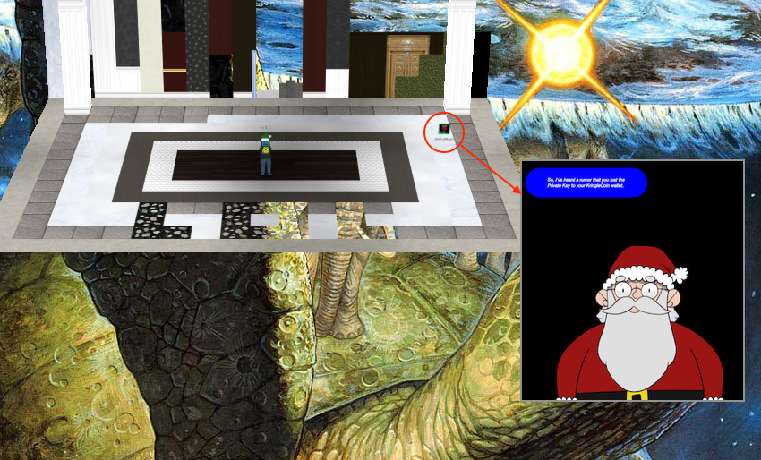

# Easter Eggs

After 5 years I've made peace with the fact that it's near impossible to find all the Easter eggs and referencs hidden around the North Pole. It's simply amazing how many of these funny little treasures you can find once you start looking around for them. Things like movie references, jokes, nods to popular culture, memes, secret areas, references to past Holiday Hack Challenge, and funny WebSocket response messages. Below, in no particular order, are just the ones I came across.

## Five Golden Rings

Surprise! This year's event announcement continues the KringleCon title trend set by previous iterations. 2019 was titled *KringleCon 2: Turtle Doves*, in 2020 it was *KringleCon 3: French Hens*, and 2021 finally brought us *KringleCon 4: Four Calling Birds*. This time around we get *KringleCon 5: Golden Rings* which is a reference to the fifth verse from the [Twelve Days of Christmas](https://genius.com/Christmas-songs-the-twelve-days-of-christmas-lyrics) carol.

!!! abstract "The Twelve Days Of Christmas"
    ... 
    On the second day of Christmas 
    My true love gave to me: 
    **Two turtle doves** 
    ... 
    On the third day of Christmas 
    My true love gave to me: 
    **Three french hens** 
    ... 
    On the forth day of Christmas 
    My true love gave to me: 
    **Four calling birds** 
    ... 
    On the fifth day of Christmas
    My true love sent to me: 
    **Five golden rings** 
    ...

## The Lord of the Rings

It starts the moment you arrive at the North Pole and Ninjula's [Return of the Song of the Spire but with More Santa](https://www.holidayhackchallenge.com/2022/album/Ninjula%20-%20Return%20of%20the%20Song%20of%20the%20Spire%20but%20with%20More%20Santa.mp3) whisks you back to 2001 with a Christmassy version of Howard Shore's [The Shire](https://www.youtube.com/watch?v=2uNDR2ASmH8) from [The Lord of the Rings](https://www.imdb.com/title/tt0120737/) (LoTR). It doesn't stop there though. As you venture around the North Pole you'll be interacting with lots of characters and locations that have some reference to LoTR lore. From Sporcs and a Snowrog to NPC's named Grinchum, Smilegol, Rippin Proudboot, and Timpy Toque.

| Name             | Reference               | Location                                                         |
| :--------------- | :---------------------- | :--------------------------------------------------------------- |
| Flobbits         | Hobbits                 | The friendly NPCs                                                |
| Sporcs           | Orcs                    | The less friendly NPCs from the Burning Ring of Fire             |
| Snowrog          | Balrog                  | Monster near [Suricata Regatta](./objectives/o4.md)              |
| Rippin Proudboot | Pippin + Mrs. Proudfoot | NPC near [Jolly CI/CD](./objectives/o7.md)                       |
| Grinchum         | Grinch + Gollum         | NPC found at several locations across the map                    |
| Timpy Toque      | Pippin Took             | NPC in Santa's castle                                            |
| Smilegol         | Smeagol                 | NPC in Santa's castle                                            |
| Samways          | Samwise                 | Account name in the [Prison Escape](./objectives/o6.md) terminal |
| Hal Tandybuck    | Merry Brandybuck        | NPC near [Open Boria Mine Door](./objectives/o9.md)              |
| Boria Mine       | Mines of Moria          | Location of [Glamtariel's Fountain](./objectives/o10.md)         |
| Glamtariel       | Galadriel               | The princess in [Glamtariel's Fountain](./objectives/o10.md)     |
| Rom Bambidil     | Tom Bombadil            | Easter egg in [Glamtariel's Fountain](./objectives/o10.md)       |

If there was any doubt about the overall theme of the event being The Lord of the Rings, some of the avatar images are a direct reference with filenames like `smeagol.png`, `hobbit1.png`, and `orc1.png`. Smilegol to Grinchum's transformation is also hinted at in two `powershell.evtx.log` entries in the [Windows Event Logs](./objectives/o3.md) objective.

## Rom Bambidil

While this is also a reference to The Lord of the Rings, it's worth noting separately as it's an Easter egg you need to explictly search for while solving [Glamtariel's Fountain](./objectives/o10.md). When you leverage [XML external entity injection](https://portswigger.net/web-security/xxe) to retrieve the green ring at `/app/static/images/x_phial_pholder_2022/greenring.txt` it will return an image that's a reference to [Tom Bombadil](https://lotr.fandom.com/wiki/Tom_Bombadil).

{ class=border }

## Brozeek and Crozag

Brozeek is a reference to the [Zeek network security monitoring tool](https://zeek.org/) which was previously named Bro. Crozak on the other hand appears to be somekind of variation on Brozeek's name: Bro > Cro, zeek > zag.

## Bird references

One of the canaries will respond with a reference to Tweety Bird's well known [*I Tawt I Taw a Puddy Tat*](https://www.youtube.com/watch?v=w-tZef9gmug) line. The other will respond with a reference to Pintel's [*Hello poppet*](https://www.youtube.com/watch?v=4kdjPhmQA0k) line from [Pirates of the Caribbean: The Curse of the Black Pearl](https://www.imdb.com/title/tt0325980/).

## Jason

Anyone who's played SANS Holiday Hack Challenge a few times before knows [Jason](https://twitter.com/BanjoCrashland/)'s always hidden somewhere in the game. This time he gets to play the role of a sleeping canary with some glorious plumage near the entrance of the Burning Ring of Fire! While it seems like a step up from his flush handle cameo from the  year prior, they actually kept the toilet flush sounds!

## Dimitri

Another reference, similar to Jason, is [Dimitri](https://knowyourmeme.com/memes/dimitri-finds-out). This year he's a hat which can be found in one of the treasure chests.

## Boaty McBoatFace

The asset name for the boat in Elfen Ring is [Boaty McBoatface](https://en.wikipedia.org/wiki/Boaty_McBoatface)! :D

{ class=border }

## Web socket messages

The WebSocket at `wss://2022.kringlecon.com/ws` is a lot of fun to play around with. The `WS_OHHIMARK` and `DENNIS_NEDRY` response message types are references to the movies [The Room](https://www.youtube.com/watch?v=aekfPU0SwNw) and [Jurassic Park](https://www.youtube.com/watch?v=RfiQYRn7fBg), respectively.

=== ":material-message-text: WS_OHHIMARK"
    { class=border }

=== ":material-message-text: DENNIS_NEDRY"
    { class=border }

## Game of Thrones

[Jolly CI/CD](./objectives/o7.md) appears to be a reference to Game of Thrones (GoT) with mentions of [houses from the North](https://gameofthrones.fandom.com/wiki/Category:Houses_from_the_North).

!!! abstract "Welcome message"
    Greetings Noble Player,

    Many thanks for answering our desperate cry for help!

    You may have heard that some evil Sporcs have opened up a web-store selling
    counterfeit banners and flags of the many **noble houses found in the land of
    the North**! They have leveraged some dastardly technology to power their
    storefront, and this technology is known as PHP!

## Bored Ape Yacht Club

The [Bored Sporc Rowboard Society](https://boredsporcrowboatsociety.com/) (BSRS) is a direct reference to the [Bored Ape Yacht Club](https://boredapeyachtclub.com/#/) (BAYC). The website logo, the wording, the clubhouse image, and the overall styling of banners and buttons all match up almost perfectly with the BAYC website.

The cherry on the cake is probably the footnote about the clubhouse though! :joy:

!!! quote "BSRS website footer"
    *This is an artist's rendering of the clubhouse we're considering building if we end up, like, rollin' in it after this NFT thing takes off. This does not represent the actual clubhouse which right now is kinda just, like, the bottom level of my parent's cave. I moved home about ten years ago, after I got, like, laid-off from my job working Sporc Squad for Beast Buy. My boss, Chordclak, was a total lamer... Anyway, that picture isn't the real clubhouse. My old girlfriend, Glanchorf, she drew that. I always told her that she should go to art school and stuff because, like, she was really talented and all, but she just kept working at Burgher King and eventually she dumped me for that lamer Chordclak. I kept the picture though, and decided to use it on this site.

    And just in case you're reading this Chordclak, I'm gonna be rich and you suck.

## The Discworld

If you walk along the left side to the back of Santa's castle, you'll end up in an area named *\_\_Shenanigans\_\_*. The room's [backdrop](./img/misc/turtles.jpg) is an image of [the Discworld](https://en.wikipedia.org/wiki/Discworld_(world)), a fictional setting for all of Terry Pratchett's Discworld fantasy novels. If you've forgotten the private key to your KringleCoin (KC) wallet, you can use the terminal to call Santa who will help your recover it.

## Literal beanie hat

You can buy literal *beanie* hats from the hat vending machine. Hats made out of actual coffee beans... :smile:

{ class=border }

## You are awesome!

Last, but not least, the [background image](./img/misc/underground_main.jpg) to the underground tunnels contains a special message of support to everyone who decides to spend some time at the North Pole, helping out Santa solve all these challenges. *You are awesome!*

