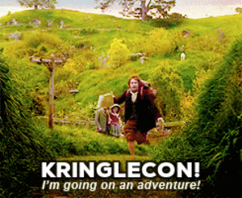
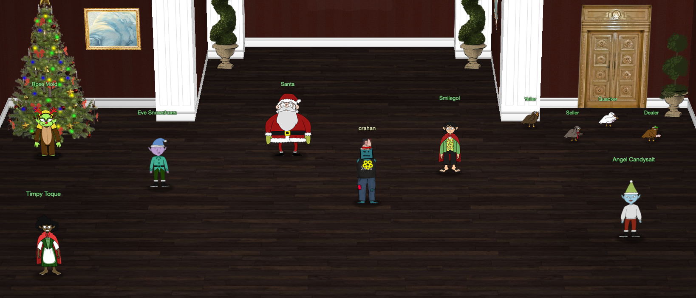

# Welcome

## Introduction

{ align=left } Hello there and welcome to my [2022 SANS Holiday Hack Challenge](https://holidayhackchallenge.com/2022/) write-up. Here we are again, for the fifth time no less. In [2020](https://n00.be/HolidayHackChallenge2020/), my write-up was selected as the best technical answer. In [2021](https://n00.be/HolidayHackChallenge2021/), I was extremely humbled to win first prize. This year, more than ever, my motivation is *you*. The first time participant, the cybersecurity enthousiast, the seasoned professional, and every type of player in between. May this write-up provide you with that nudge to help solve that final challenge or be a learning guide as you dip your toes in the exciting world of cybersecurity! :hugging_face:

Unlike previous years, this time around there are only two main sections. There's this page, which contains the introduction, answers, the overall narrative, and final conclusion. And there's [Objectives](./objectives/o1.md), where you'll find the individual challenge write-ups, organized by ring type, for which an answer had to be submitted. Hints are now a lot more closely integrated. You'll collect them as part of the normal story progression and by keeping an eye out for 6 hidden chests spread around the North Pole. Finally, no SANS Holiday Hack Challenge write-up is really complete without a list of [Easter eggs](./easter_eggs.md) and references found along the way, a little bit of [cheating](./objectives/o2.md#cheating), and the odd [custom script](https://github.com/crahan/HolidayHackChallenge2022/tree/main/docs/tools) or two. Enjoy!

!!! note "50-page submission limit"
    Each year there's a huge number of write-ups that need to be reviewed by the Counter Hack team. To find a good middle ground between preventing information overload and creating a write-up that can stand on its own as a learning resource, some parts, like the *navigation tip* below, are collapsed by default. Skipping over these will not take away from understanding the overall solution, but feel free to expand them to get some additional information.

??? tip "Navigation tip"
    Even with less than 50 pages, there's still quite a bit of information to read through. To make things a little easier, you can use ++"P"++ or ++","++ to go to the previous section, ++"N"++ or ++"."++ to navigate to the next section, and ++"S"++, ++"F"++, or ++"/"++ to open up the search dialog.

    **TL;DR** if you keep pressing ++"N"++ or ++"."++ from this point forward, you'll hit all the content in the right order! :smile:

## Answers

!!! success "1. KringleCon Orientation - :fontawesome-solid-star::fontawesome-regular-star::fontawesome-regular-star::fontawesome-regular-star::fontawesome-regular-star:"
    Follow [Jingle Ringford's instructions](./objectives/o1.md) to create a KringleCon wallet and open the gate.

!!! success "2. Wireshark Practice - :fontawesome-solid-star::fontawesome-regular-star::fontawesome-regular-star::fontawesome-regular-star::fontawesome-regular-star:"
    Investigate the `suspicious.pcap` packet capture file and [answer all the questions](./objectives/o2.md).

!!! success "3. Windows Event Logs - :fontawesome-solid-star::fontawesome-solid-star::fontawesome-regular-star::fontawesome-regular-star::fontawesome-regular-star:"
    Investigate the `powershell.evtx` log file and [answer all the questions](./objectives/o3.md).

!!! success "4. Suricata Regatta - :fontawesome-solid-star::fontawesome-solid-star::fontawesome-solid-star::fontawesome-regular-star::fontawesome-regular-star:"
    Add the [4 requested Suricata rules](./objectives/o4.md) to the `suricata.rules` file.

!!! success "5. Clone with a Difference - :fontawesome-solid-star::fontawesome-regular-star::fontawesome-regular-star::fontawesome-regular-star::fontawesome-regular-star:"
    [maintainers](./objectives/o5.md)

!!! success "6. Prison Escape - :fontawesome-solid-star::fontawesome-solid-star::fontawesome-solid-star::fontawesome-regular-star::fontawesome-regular-star:"
    [082bb339ec19de4935867](./objectives/o6.md)

!!! success "7. Jolly CI/CD - :fontawesome-solid-star::fontawesome-solid-star::fontawesome-solid-star::fontawesome-solid-star::fontawesome-solid-star:"
    [oI40zIuCcN8c3MhKgQjOMN8lfYtVqcKT](./objectives/o7.md)

!!! success "8. Boria PCAP Mining - :fontawesome-solid-star::fontawesome-solid-star::fontawesome-regular-star::fontawesome-regular-star::fontawesome-regular-star:"
    Naughty IP: [18.222.86.32](./objectives/o8.md#naughty-ip) 
    Credential Mining: [*alice*](./objectives/o8.md#credential-mining) 
    404 FTW: [`/proc`](./objectives/o8.md#404-ftw) 
    IMDS, XXE, and Other Abbreviations: [`http://169.254.169.254/latest/meta-data/identity-credentials/ec2/security-credentials/ec2-instance`](./objectives/o8.md#imds-xxe-and-other-abbreviations)

!!! success "9. Open Boria Mine Door - :fontawesome-solid-star::fontawesome-solid-star::fontawesome-solid-star::fontawesome-regular-star::fontawesome-regular-star:"
    [Find the correct keys](./objectives/o9.md) to open all the locks.

!!! success "10. Glamtariel's Fountain - :fontawesome-solid-star::fontawesome-solid-star::fontawesome-solid-star::fontawesome-solid-star::fontawesome-solid-star:"
    [`goldring-morethansupertopsecret76394734.png`](./objectives/o10.md)

!!! success "11. AWS CLI Intro - :fontawesome-solid-star::fontawesome-regular-star::fontawesome-regular-star::fontawesome-regular-star::fontawesome-regular-star:"
    Enter the [correct AWS CLI commands](./objectives/o11.md) in the AWS 101 terminal.

!!! success "12. Trufflehog Search - :fontawesome-solid-star::fontawesome-solid-star::fontawesome-regular-star::fontawesome-regular-star::fontawesome-regular-star:"
    [`put_policy.py`](./objectives/o12.md)

!!! success "13. Exploitation via AWS CLI - :fontawesome-solid-star::fontawesome-solid-star::fontawesome-solid-star::fontawesome-regular-star::fontawesome-regular-star:"
    Enter the [correct AWS CLI commands](./objectives/o13.md) in the AWS 201 terminal.

!!! success "14. Buy a Hat - :fontawesome-solid-star::fontawesome-solid-star::fontawesome-regular-star::fontawesome-regular-star::fontawesome-regular-star:"
    [Buy a hat](./objectives/o14.md) using the hat vending machine and KTM.

!!! success "15. Blockchain Divination - :fontawesome-solid-star::fontawesome-solid-star::fontawesome-solid-star::fontawesome-solid-star::fontawesome-regular-star:"
    [`0xc27A2D3DE339Ce353c0eFBa32e948a88F1C86554`](./objectives/o15.md)

!!! success "16. Exploit a Smart Contract - :fontawesome-solid-star::fontawesome-solid-star::fontawesome-solid-star::fontawesome-solid-star::fontawesome-solid-star:"
    [Buy a Bored Sporc NFT](./objectives/o16.md) by exploiting a flaw in the smart contract.

## Conclusion

!!! Abstract "Narrative"
    Five Rings for the Christmas king immersed in cold 
    Each Ring now missing from its zone 
    The first with bread kindly given, not sold 
    Another to find 'ere pipelines get owned 
    One beneath a fountain where water flowed 
    Into clouds Grinchum had the fourth thrown 
    The fifth on blockchains where shadows be bold 
    One hunt to seek them all, five quests to find them 
    One player to bring them all, and Santa Claus to bind them

!!! quote "Santa"
    Congratulations! You have foiled Grinchum's foul plan and recovered the Golden Rings! 
    And by the magic of the rings, Grinchum has been restored back to his true, merry self: Smilegol! 
    You see, all Flobbits are drawn to the Rings, but somehow, Smilegol was able to snatch them from my castle. 
    To anyone but me, their allure becomes irresistable the more Rings someone possesses. 
    That allure eventually tarnishes the holder's Holiday Spirit, which is about giving, not possesing. 
    That's exactly what happened to Smilegol; that selfishness morphed him into Grinchum. 
    But thanks to you, Grinchum is no more, and the holiday season is saved! 
    Ho ho ho, happy holidays!

!!! quote "Smilegol"
    I must give you my most thankful of thanks, and most sorry of sorries. 
    I'm not sure what happened, but I just couldn't resist the Rings' call. 
    But once you returned the Rings to Santa, I was no longer so spellbound. 
    I could think clearly again, so I shouted off that awful persona. 
    And that grouchy Grinchum was gone for good. Now, I can be me again, just in time for gift giving. 
    This is a lesson I won't soon forget, and I certainly won't forget you. 
    I wish you smooth sailing on wherever your next voyage takes you!

??? quote "Timpy Toque"
    Thank you for saving Smilegol and protecting the Rings. 
    You will always be a friend of the Flobbits.

??? quote "Eve Snowshoes"
    Hello there, super helper! I'm Eve Snowshoes. 
    The other elves and I are so glad you were able to help recover the rings! 
    The holidays wouldn't have been the same without your hard work. 
    If you'd like, you can order [special swag](https://www.youtube.com/watch?v=dQw4w9WgXcQ) that's only available to our victors! 
    Thank you!

??? quote "Angel Candysalt"
    Greetings North Pole savior! I'm Angel Candysalt! 
    A euphemism? No, that's my name. Why are people still asking me that? 
    Anywho, thank you for everything you've done. 
    You'll go down in history!

??? quote "Rose Mold"
    I'm Rose Mold. What planet are you from? 
    What am I doing here? I could ask the same of you! 
    Collecting web, cloud, elfen rings... What about onion rings? A Sebring? 
    n00bs...
