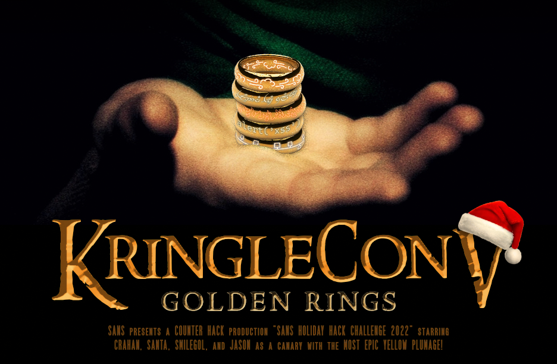

# Welcome

## Introduction

{ align=left } Hello there and welcome to my [2022 SANS Holiday Hack Challenge](https://holidayhackchallenge.com/2022/) write-up. Here we are again, for the fifth time no less. In 2020, my write-up won best technical answer. In 2021, I was extremely fortunate to win first prize. This year, more than ever, my motivation is you. The first time player, the cybersecurity enthousiast, the seasoned professional, and every role in between. May this write-up provide you with that nudge to help solve that final challenge or be a learning guide as you dip your toes in the exciting world of cybersecurity! :hugging_face:

Similar to previous years, there's 3 main sections. This page which contains the introduction, answers, the overall narrative, and final conclusion. [Objectives](./objectives/o1.md) contains the write-ups for the main objectives for which an answer had to be submitted and [Terminal Hints](./hints/h2.md) has the write-ups for the additional side challenges which provide you with hints to help solve the main objectives.

As always, there's a few things worth highlighting like [insert list of interesting challenges, solutions, and hacks], the very incomplete list of [Easter eggs](./easter_eggs.md), and all of the [custom scripts](https://github.com/crahan/HolidayHackChallenge2022/tree/main/docs/tools) used throughout the game.

!!! note "50-page submission limit"
    Each year there's a huge number of write-ups that need to be reviewed by the SANS and Counter Hack teams. To find a good middle ground between preventing information overload and creating a write-up that can stand on its own as a learning resource, some parts, like the *navigation tip* below, are collapsed by default. Skipping over these will not take away from understanding the overall solution, but feel free to expand them to get some additional information.

??? tip "Navigation tip"
    Even with less than 50 pages, there's still quite a bit of information to read through. To make things a little easier, you can use ++"P"++ or ++","++ to go to the previous section, ++"N"++ or ++"."++ to navigate to the next section, and ++"S"++, ++"F"++, or ++"/"++ to open up the search dialog.

    **TL;DR** if you keep pressing ++"N"++ or ++"."++ from this point forward, you'll hit all the content in the right order! :smile:

## Answers

!!! done "1. Objective 1 - :fontawesome-solid-star::fontawesome-regular-star::fontawesome-regular-star::fontawesome-regular-star::fontawesome-regular-star:"
    [Answer to Objective 1](./objectives/o2.md)

!!! done "2. Objective 2 - :fontawesome-solid-star::fontawesome-regular-star::fontawesome-regular-star::fontawesome-regular-star::fontawesome-regular-star:"
    [Answer to Objective 2](./objectives/o2.md)

!!! done "3. Objective 3 - :fontawesome-solid-star::fontawesome-regular-star::fontawesome-regular-star::fontawesome-regular-star::fontawesome-regular-star:"
    [Answer to Objective 3](./objectives/o3.md)

!!! done "4. Objective 4 - :fontawesome-solid-star::fontawesome-regular-star::fontawesome-regular-star::fontawesome-regular-star::fontawesome-regular-star:"
    [Answer to Objective 4](./objectives/o4.md)

!!! done "5. Objective 5 - :fontawesome-solid-star::fontawesome-regular-star::fontawesome-regular-star::fontawesome-regular-star::fontawesome-regular-star:"
    [Answer to Objective 5](./objectives/o5.md)

!!! done "6. Objective 6 - :fontawesome-solid-star::fontawesome-regular-star::fontawesome-regular-star::fontawesome-regular-star::fontawesome-regular-star:"
    [Answer to Objective 6](./objectives/o6.md)

!!! done "7. Objective 7 - :fontawesome-solid-star::fontawesome-regular-star::fontawesome-regular-star::fontawesome-regular-star::fontawesome-regular-star:"
    [Answer to Objective 7](./objectives/o7.md)

!!! done "8. Objective 8 - :fontawesome-solid-star::fontawesome-regular-star::fontawesome-regular-star::fontawesome-regular-star::fontawesome-regular-star:"
    [Answer to Objective 8](./objectives/o8.md)

!!! done "9. Objective 9 - :fontawesome-solid-star::fontawesome-regular-star::fontawesome-regular-star::fontawesome-regular-star::fontawesome-regular-star:"
    [Answer to Objective 9](./objectives/o9.md)

!!! done "10. Objective 10 - :fontawesome-solid-star::fontawesome-regular-star::fontawesome-regular-star::fontawesome-regular-star::fontawesome-regular-star:"
    [Answer to Objective 10](./objectives/o10.md)

!!! done "11. Objective 11 - :fontawesome-solid-star::fontawesome-regular-star::fontawesome-regular-star::fontawesome-regular-star::fontawesome-regular-star:"
    [Answer to Objective 11](./objectives/o11.md)

!!! done "12. Objective 12 - :fontawesome-solid-star::fontawesome-regular-star::fontawesome-regular-star::fontawesome-regular-star::fontawesome-regular-star:"
    [Answer to Objective 12](./objectives/o12.md)

!!! done "13. Objective 13 - :fontawesome-solid-star::fontawesome-regular-star::fontawesome-regular-star::fontawesome-regular-star::fontawesome-regular-star:"
    [Answer to Objective 2](./objectives/o13.md)

## NPC locations

| :material-account: Name | :material-home: Event | :material-pound: Floor | :material-map-marker: Area | :material-gamepad: Challenge     | :material-format-list-bulleted: Type |
| :---------------------- | :-------------------: | :--------------------: | :------------------------- | :------------------------------- | :----------------------------------: |
| NPC name                |         Event         |           x            | Area 1                     | [Objective 1](objectives/o1.md)  |                  O                   |
| NPC name                |         Event         |           Y            | Area 2                     | [Terminal Hunt 1](./hints/h1.md) |                  T                   |

## Conclusion

??? Abstract "Narrative"
    Insert completed narrative.

!!! quote "NPC 1"
    Insert NPC quote 1.

!!! quote "NPC 2"
    Insert NPC quote 2.

!!! quote "NPC 3"
    Insert NPC quote 3.
