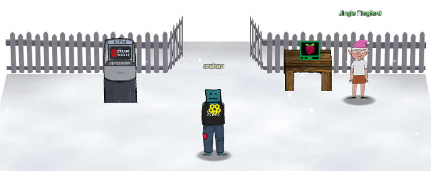

# KringleCon Orientation

**Difficulty**: :fontawesome-solid-star::fontawesome-regular-star::fontawesome-regular-star::fontawesome-regular-star::fontawesome-regular-star: 
**Direct link**: [Orientation terminal](https://hhc22-wetty.kringlecon.com/?&challenge=orientation&id=208abc15-122f-4f27-b3e9-24a0cbe34c40)

## Objective

!!! question "Request"
    Get your bearings at KringleCon

??? quote "Jingle Ringford"
    Welcome to the North Pole, KringleCon, and the 2022 SANS Holiday Hack Challenge! I’m Jingle Ringford, one of Santa’s elves. 
    Santa asked me to come here and give you a short orientation to this festive event. 
    Before you move forward through the gate, I’ll ask you to accomplish a few simple tasks. 

## Solution

This first challenge is designed to help you get your bearings and to solve it we simply need to follow Jingle Ringford's instructions. Each task is designed to help explain part of the game mechanics: talk to Jingle Ringford, get our badge, create a KringleCoin wallet, and use the terminal to open the gate. Start by clicking on Jingle Ringford's avatar to initiate a conversation.

!!! quote "Jingle Ringford"
    First things first, here's your badge! It's the five golden rings in the middle of your avatar. 
    Great - now you're official! 
    Click on the badge on your avatar. That’s where you will see your Objectives, Hints, and gathered Items for the Holiday Hack Challenge. 
    We’ve also got handy links to the KringleCon talks and more there for you! 
    Next, click on that machine to the left and create a crypto wallet for yourself. Don't lose that key! 

Click on the [KringleCoin Teller Machine](https://prod-ktm-create.kringle.co.in?&challenge=atmcreate) (KTM) and follow the on-screen instructions to create your personal KringleCoin cryptocurrency wallet. Be sure to note down your wallet address and personal wallet key as you will need them throughout the game, but don't worry too much about the message stating your key cannot be recovered. If lost, there is [a way](../easter_eggs.md#the-discworld) to retrieve it! :santa:.

!!! quote "Jingle Ringford"
    Fantastic! 
    OK, one last thing. Click on the Cranberry Pi Terminal and follow the on-screen instructions.

Finally, click on the [terminal](https://hhc22-wetty.kringlecon.com/?&challenge=orientation&id=208abc15-122f-4f27-b3e9-24a0cbe34c40) to open it, select the top pane, enter *answer*, and press ++"Enter"++ to complete the challenge.

{ class=border }

Once completed, close the terminal window and continue on through the open gate.

{ class=border }

!!! success "Answer"
    Follow Jingle Ringford's instructions to create a KringleCoin wallet and open the gate.

## Response

!!! quote "Jingle Ringford"
    Great! Your orientation is now complete! You can enter through the gate now. Have FUN!!!
