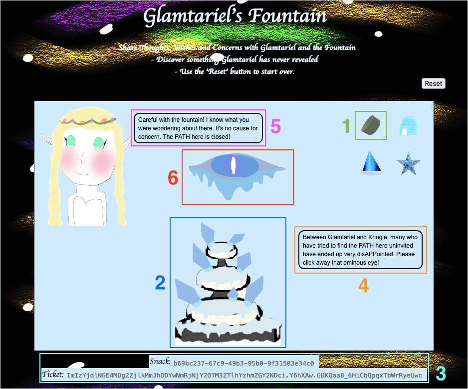
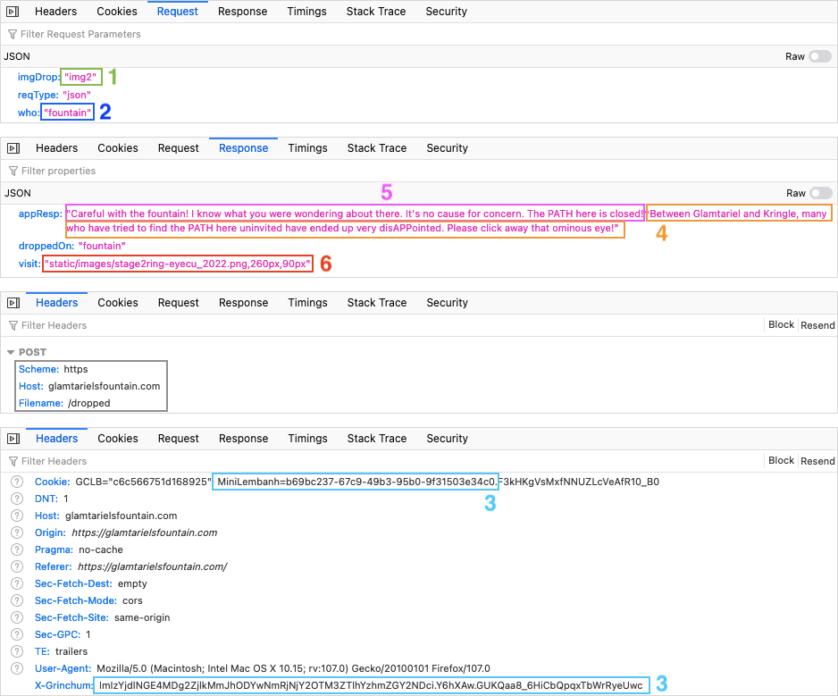
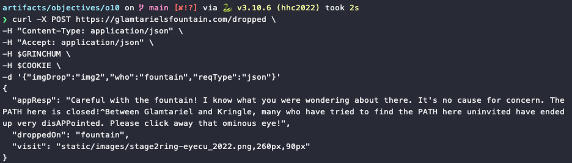
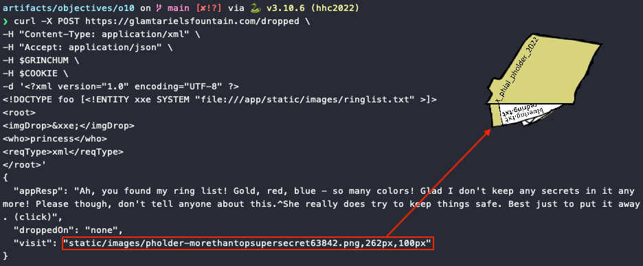
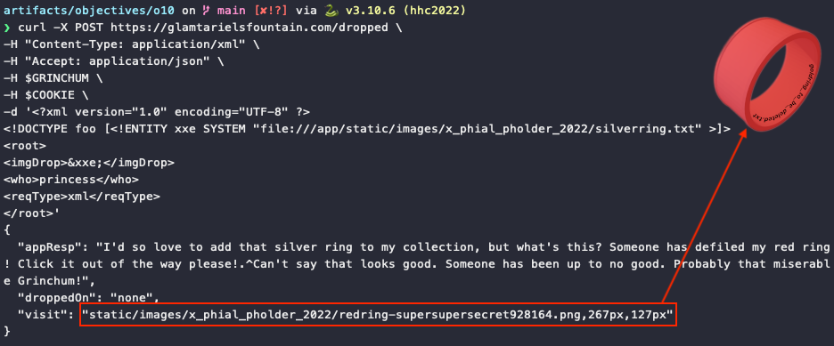
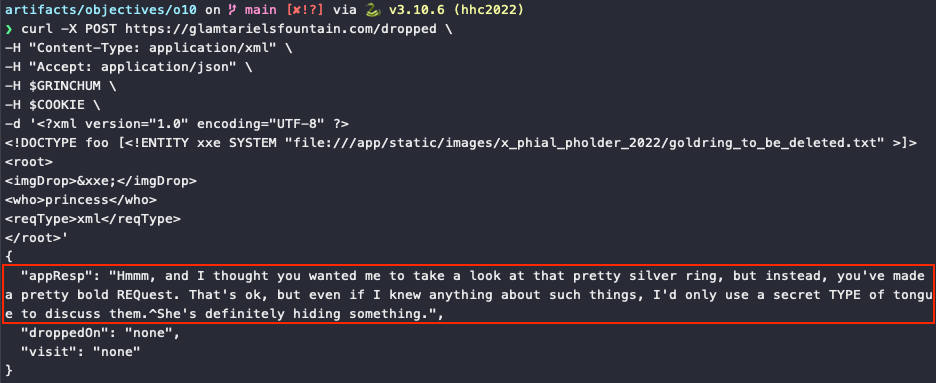
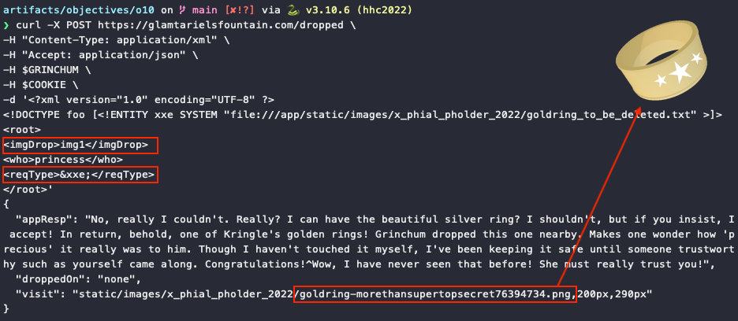
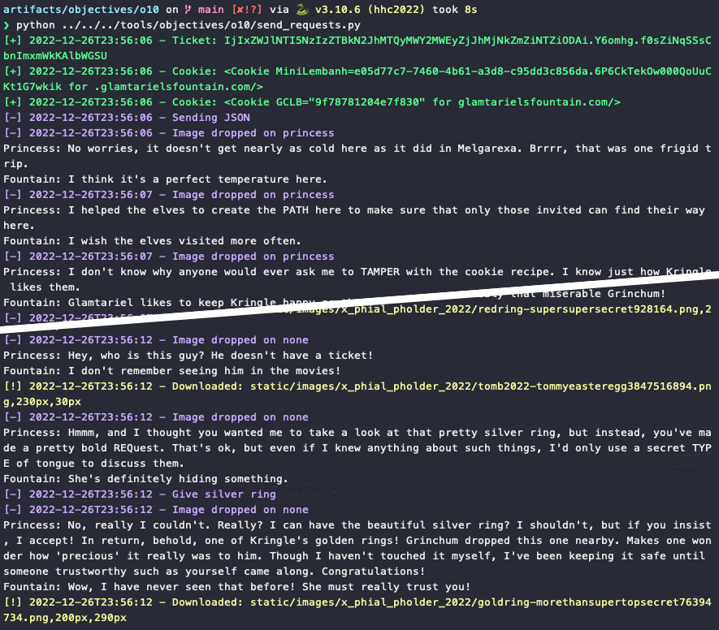

# Glamtariel's Fountain

**Difficulty**: :fontawesome-solid-star::fontawesome-solid-star::fontawesome-solid-star::fontawesome-solid-star::fontawesome-solid-star:<br/>
**Direct link**: [Glamtariel's Fountain website](https://glamtarielsfountain.com/)

## Objective

!!! question "Request"
    Stare into Glamtariel's fountain and see if you can find the ring! What is the filename of the ring she presents you? Talk to Hal Tandybuck in the Web Ring for hints.

??? quote "Akbowl"
    Huh - what? Why do you disturb Akbowl?<br/>
    I'm trying to get the ring in here for the Sporc Chief.<br/>
    Unlucky for me it's lost in this water basin thing.<br/>
    You will not get it out before Akbowl!


## Hints

??? tip "Significant CASE"
    Early parts of this challenge can be solved by focusing on Glamtariel's WORDS.

??? tip "eXternal Entities"
    Sometimes we can hit web pages with [XXE](https://owasp.org/www-community/vulnerabilities/XML_External_Entity_(XXE)_Processing) when they aren't expecting it!


## Solution

### Gathering additional information

While it might be tempting to dive right in and throwing HTTP requests around, it really helps to take a step back and take note of exactly what Glamtariel and the fountain are saying. As noted in one of the hints, responses containing uppercase words are important. So, let's start by dragging all three batches of four images onto both entities and collecting some additional hints.

!!! tip "Additional hints"
    1. I helped the elves to create the **PATH** here to make sure that only those invited can find their way here.
    2. I don't know why anyone would ever ask me to **TAMPER** with the cookie recipe. I know just how Kringle likes them.
    3. The elves do a great job making **PATH**s which are easy to follow once you see them.
    4. Kringle really dislikes it if anyone tries to **TAMPER** with the cookie recipe Glamtariel uses.
    5. Did you know that I speak in many **TYPE**s of languages? For simplicity, I usually only communicate with this one though.
    6. I pretty much stick to just one **TYPE** of language, it's a lot easier to share things that way.
    7. Careful with the fountain! I know what you were wondering about there. It's no cause for concern. The **PATH** here is closed!
    8. Between Glamtariel and Kringle, many who have tried to find the **PATH** here uninvited have ended up very dis**APP**ointed.
    9. Wow!, what a beautiful silver ring! I don't have one of these. I keep a list of all my rings in my **RINGLIST** file.
    10. I never heard Glamtariel mention a **RINGLIST** file before. If only there were a way to get a peek at that.
    11. I like to keep track of all my rings using a **SIMPLE FORMAT**, although I usually don't like to discuss such things.
    12. You know, I've heard Glamtariel talk in her sleep about rings using a different **TYPE** of language.

Sentences containing uppercase words can be grouped into four categories: the risk of cookie tampering, a path we need to build, a different type of language spoken by the princess, and the ringlist file the princess uses to store her ring collection.


### Inspecting HTTP requests and responses

With a solid list of additional hints in our back pocket, we can start taking a look at what exactly goes on behing the scenes when dragging images to either the princess or the fountain. Select the tabs below to get a better understanding of the relationship between the different UI elements and how they are represented in the associated HTTP traffic.

=== ":fontawesome-regular-image: Rendered HTML"
    

=== ":material-chart-timeline: HTTP requests"
    

Each time an image is dragged onto an entity, an HTTP POST request containing JSON data is sent to the `/dropped` URL path. The JSON data contains the image being dragged (1), who it was dragged to (2), and the type of request. Important to note is that each request also contains both a cookie and a [CSRF token](https://brightsec.com/blog/csrf-token/) (i.e., ticket) which is sent via the `X-Grinchum` HTTP request header (3).

The JSON data in the HTTP responses contains the message from the fountain (4) and the princess (5), who the image was dropped on, and a `visit` field containing either *none* or a path to an image (6). In the example above, the link points to the [`stage2ring-eyecu_2022.png`](../artifacts/objectives/o10/stage2ring-eyecu_2022.png) image which appears on screen right before moving to the stage with the four rings.

Using this information we can now use tools like [curl](https://curl.se/), [Postman](https://www.postman.com/), [Paw](https://paw.cloud/), or even a [Python script](#automating) to partially or fully automate these HTTP requests so we don't have to go through the tedious task of manually dragging and dropping images in a web browser.

```shell linenums="1" title="JSON HTTP requests via curl"
export COOKIE='Cookie:MiniLembanh=COOKIE_VALUE_COPIED_FROM_WEB_BROWSER'
export GRINCHUM='X-Grinchum:TICKET_VALUE_COPIED_FROM_WEB_BROWSER'

curl -X POST https://glamtarielsfountain.com/dropped \
-H "Content-Type: application/json" \
-H "Accept: application/json" \
-H $GRINCHUM \
-H $COOKIE \
-d '{"imgDrop":"img2","who":"fountain","reqType":"json"}'
```

{ class=border }


### Accessing the ringlist

We know the princess speaks an additional type of language (i.e., XML) and she stores here rings in a ringlist. Putting together *disAPPointed* (i.e., `/app` root), *PATHs which are easy to follow* (i.e., `/static/images/`), *my RINGLIST file* (i.e., `ringlist`), and *using a SIMPLE FORMAT* (i.e., `.txt`) helps us to determine that the location of the ringlist file is `/app/static/images/ringlist.txt`.

We can now switch from JSON to XML HTTP requests and leverage [XML External Entity injection](https://owasp.org/www-community/vulnerabilities/XML_External_Entity_(XXE)_Processing) (XXE) to access the `ringlist.txt` file. We need to make sure that the `Content-Type` header and `ReqType` field are set to *application/xml* (line 2) and *xml* (line 11), respectively. The `imgDrop` field can be used to trigger the injection itself (lines 7 and 9).

```shell linenums="1" hl_lines="2 7 9 11" title="Accessing the ringlist through XXE injection"
curl -X POST https://glamtarielsfountain.com/dropped \
-H "Content-Type: application/xml" \
-H "Accept: application/json" \
-H $GRINCHUM \
-H $COOKIE \
-d '<?xml version="1.0" encoding="UTF-8" ?>
<!DOCTYPE foo [<!ENTITY xxe SYSTEM "file:///app/static/images/ringlist.txt" >]>
<root>
<imgDrop>&xxe;</imgDrop>
<who>princess</who>
<reqType>xml</reqType>
</root>'
```

{ class=border }


### Scavenger hunt

The princess' response to the ringlist request kicks off a mini scavenger hunt where every response returns a path to a PNG image holding a hint for the next request. The [first image](../artifacts/objectives/o10/pholder-morethantopsupersecret63842.png) is located at `static/images/pholder-morethantopsupersecret63842.png` and shows a pixelated folder named `x_phial_pholder_2022` which contains a `bluering.txt` and `redring.txt` file.

Trying to use XXE injection to access `/app/static/images/x_phial_pholder_2022/bluering.txt` or `/app/static/images/x_phial_pholder_2022/redring.txt` doesn't yield any results. However, keeping the path but changing the filename to `silverring.txt`, which we know the princess would really *really* like to add to her collection, takes us to the next step.

??? info "Rom Bambidil Easter egg"
    A request to access `/app/static/images/x_phial_pholder_2022/greenring.txt` results in a Lord of the Rings reference and [Easter egg](../easter_eggs.md#rom-bambidil)! :smile:

{ class=border }

The inscription on the red ring in the [second image](../artifacts/objectives/o10/redring-supersupersecret928164.png) tells us the next file is `goldring_to_be_deleted.txt`. Unfortunately, trying to access that file annoys the Princess somewhat and she tells us she thought we wanted her to look at the silver ring.

{ class=border }


### Exchanging the silver for the gold ring

To get the golden ring, we can't just straight up grab it from the princess. Instead, we need to exchange it for the silver ring. At the start of the challenge we determined that giving something to the princess for her to look at is done through the `imgDrop` field, which means we can't use that field for triggering XXE injection anymore. Instead, we need to use the REQ and TYPE hint from the latest response and swap our XXE injection to the `reqType` field.

{ class=border }

This time, we're given the [golden ring](../artifacts/objectives/o10/goldring-morethansupertopsecret76394734.png) and with that the answer to this challenge! :thumbsup:

!!! note "Automating the challenge using Python<span id="automating"></span>"
    Clicking and dragging images or copy/pasting `curl` commands can become a little tedious. [This Python script](../tools/objectives/o10/send_requests.py) automates the process by retrieving a valid cookie and CSRF token (i.e., ticket), sending the initial JSON requests, executing the necessary XXE injections, and downloading all the image assets.

    

!!! success "Answer"
    `goldring-morethansupertopsecret76394734.png`


## Response

!!! quote "Akbowl"
    No! That's not yours!<br/>
    This birdbath showed me images of this happening.<br/>
    But I didn't believe it because nobody is better than Akbowl!<br/>
    Akbowl's head is the hardest! That's what the other sporcs tell me.<br/>
    I guess Akbowl's head is not the smartest.
