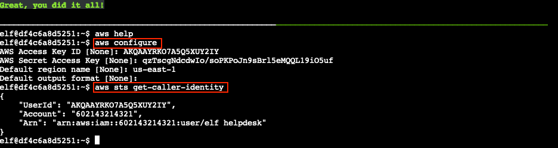

# AWS CLI Intro

**Difficulty**: :fontawesome-solid-star::fontawesome-regular-star::fontawesome-regular-star::fontawesome-regular-star::fontawesome-regular-star: 
**Direct link**: [AWS 101 terminal](https://hhc22-wetty.kringlecon.com/?&challenge=aws101)

## Objective

!!! question "Request"
    Try out some basic AWS command line skills in this terminal. Talk to Jill Underpole in the Cloud Ring for hints.

??? quote "Jill Underpole"
    Umm, can I help you? 
    Me? I'm Jill Underpole, thank you very much. 
    I'm working on this here smoke terminal. 
    Cloud? Sure, whatever you want to call it. 
    Anyway, you're welcome to try this out, if you think you know what you're doing. 
    You'll have to learn some basics about the AWS command line interface (CLI) to be successful though.

## Hints

??? tip "AWS Whoami?"
    In the AWS command line (CLI), the Secure Token Service or [STS](https://awscli.amazonaws.com/v2/documentation/api/latest/reference/sts/get-caller-identity.html) has one very useful function.

## Solution

Solving this challenge is a matter of following the step-by-step terminal instructions. Start by typing `aws help` to bring up the AWS CLI help information. To exit back to the command line, press ++"q"++. Next, run `aws configure` to [configure the AWS CLI installation](https://docs.aws.amazon.com/cli/latest/userguide/cli-configure-quickstart.html#cli-configure-quickstart-config) and enter `AKQAAYRKO7A5Q5XUY2IY`, `qzTscgNdcdwIo/soPKPoJn9sBrl5eMQQL19iO5uf`, and *us-east-1* as the access key, secret key, and region values. The final step is to use `aws sts get-caller-identity` to retrieve [details about the IAM user](https://awscli.amazonaws.com/v2/documentation/api/latest/reference/sts/get-caller-identity.html) whose credentials we used to configure the AWS CLI tool.

{ class=border }

!!! success "Answer"
    Enter the correct AWS CLI commands in the AWS 101 terminal.

## Response

!!! quote "Jill Underpole"
    Wait, you got it done, didn't you? 
    Ok, consider me impressed. You could probably help Gerty, too. 
    The first trick'll be running the Trufflehog tool. 
    It's as good at sniffing out secrets as I am at finding mushrooms! 
    After that, it's just a matter of getting to the secret the tool found. 
    I'd bet a basket of portobellos you'll get this done!
