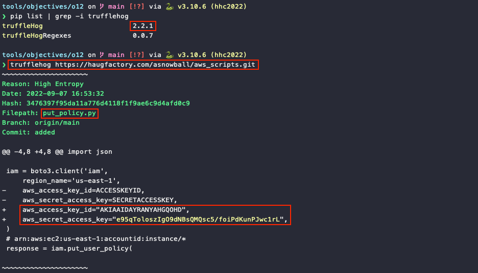
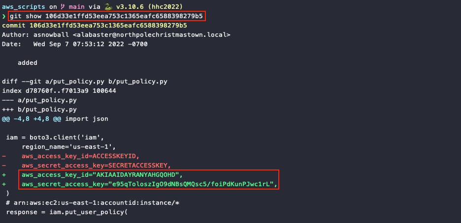

# Trufflehog Search

**Difficulty**: :fontawesome-solid-star::fontawesome-solid-star::fontawesome-regular-star::fontawesome-regular-star::fontawesome-regular-star:<br/>
**Direct link**: [aws_scripts Git repository](https://haugfactory.com/asnowball/aws_scripts.git)


## Objective

!!! question "Request"
    Use Trufflehog to find secrets in a Git repo. Work with Jill Underpole in the Cloud Ring for hints. What's the name of the file that has AWS credentials?

??? quote "Gerty Snowburrow"
    Well now, look who's venturing down into the caves!<br/>
    And well, who might you be, exaclty?<br/>
    I'm Gerty Snowburrow, if you need to know.<br/>
    And, not that I should be telling you, but I'm trying to figure out what Alabaster Snowball's done this time.<br/>
    Word is, he committed some secrets to [a code repo](https://haugfactory.com/asnowball/aws_scripts.git).<br/>
    If you're feeling so inclined, you can try and find them for me.


## Hints

??? hint "Trufflehog Tool"
    You can search for secrets in a Git repo with `trufflehog git https://some.repo/here.git`.

??? hint "Checkout Old Commits"
    If you want to look at an older code commit with git, you can `git checkout CommitNumberHere`.


## Solution

### Using a v2 Python package

First, we need to grab a copy of [TruffleHog](https://github.com/trufflesecurity/trufflehog). If we have a Python environment at our disposal we can use `pip install trufflehog` to install a v2 release of the tool. While it's an older version with less functionality, the syntax is simpler and the output also includes `git diff` information. Running `trufflehog https://haugfactory.com/asnowball/aws_scripts.git` will print several commits where AWS credentials were either added or removed from a `put_policy.py` file.

{ class=border }


### Using a v3 binary release

!!! note "A ready-to-go TruffleHog install"
    If you don't want to mess around with setting up a Python environment or downloading the right binary for your specific operating system and CPU architecture, the terminal for the [next challenge](./o13.md) already has tools like `git` and TruffleHog installed and ready to go! Simply skip over the install instructions below and go straight to running `trufflehog git https://haugfactory.com/asnowball/aws_scripts.git`. :stuck_out_tongue_winking_eye:

A second option is to use a more recent version of TruffleHog. Download the latest [binary release](https://github.com/trufflesecurity/trufflehog/releases/latest) that matches your operating system and CPU architecture, unpack the archive, and run the slightly updated `./trufflehog git https://haugfactory.com/asnowball/aws_scripts.git` command. While the output is different than before, the first result once again tells us an AWS secret was found in a `put_policy.py` file as part of commit `106d33e1ffd53eea753c1365eafc6588398279b5`.

{ class=border }

Unlike the Python package version, the output for recent binary releases does not include `git diff` information anymore. However, we can easily confirm that the `put_policy.py` file in commit `106d33e1ffd53eea753c1365eafc6588398279b5` does indeed contain the credential data by cloning the repository (line 1) and showing the commit details (line 3).

```shell linenums="1" title="Show commit details"
git clone https://haugfactory.com/asnowball/aws_scripts.git
cd aws_scripts
git show 106d33e1ffd53eea753c1365eafc6588398279b5
```

{ class=border }

!!! success "Answer"
    `put_policy.py`


## Response

!!! quote "Gerty Snowburrow"
    Say, you got it done, didn't you?<br/>
    Well now, you might just be able to tackle the other AWS terminal down here.<br/>
    It's a bit more involved, but you've got the credentials to get it started now.<br/>
    Before you try it, you should know the difference between managed and inline policies.<br/>
    Short version: inline policies apply to one identity (user, role, group), and managed policies can be attached to many identities.<br/>
    There are different AWS CLI commands to interact with each kind.<br/>
    Other than that, the important bit is to know a bit about cloud or IAM privilege escalation.<br/>
    Sometimes attackers find access to more resources by just trying things until something works.<br/>
    But if they have access to the iam service inside the AWS CLI, they might just be able to ask what access they have!<br/>
    You can do it!
