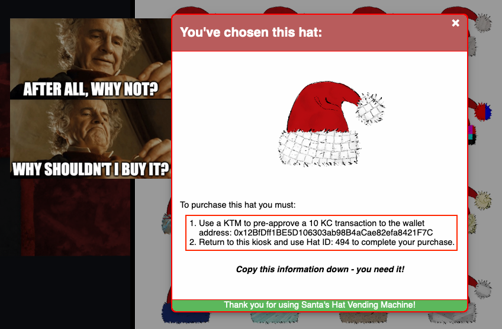
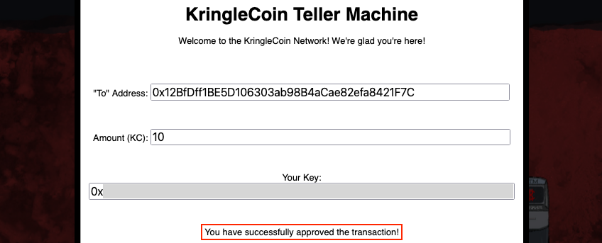
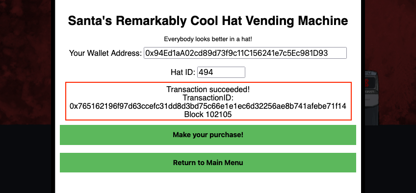
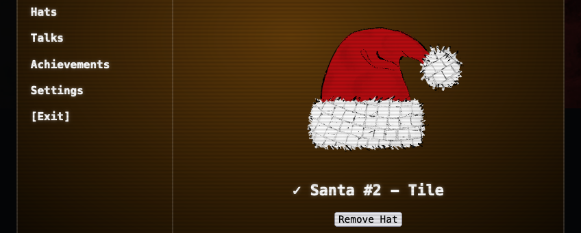
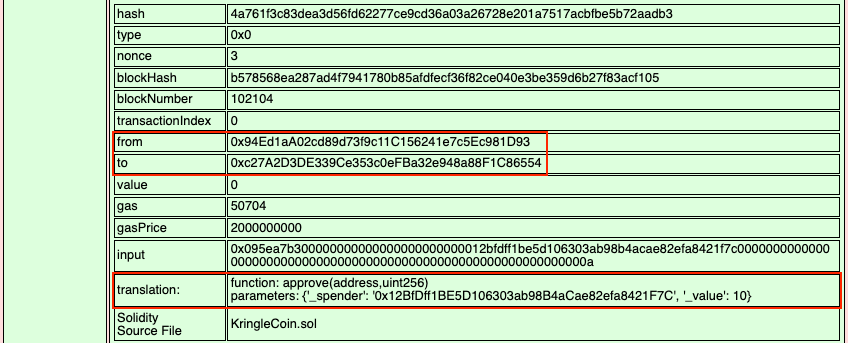
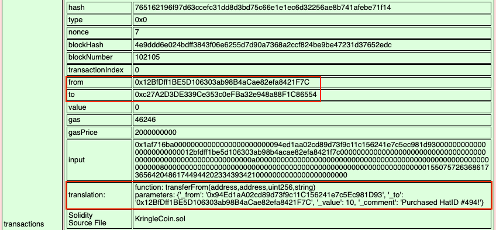

# Buy a Hat

**Difficulty**: :fontawesome-solid-star::fontawesome-solid-star::fontawesome-regular-star::fontawesome-regular-star::fontawesome-regular-star: 
**Direct link**: [Hat Vending Machine website](https://prod-hats-vending.kringle.co.in/?&challenge=hats)

## Objective

!!! question "Request"
    Travel to the Burning Ring of Fire and purchase a hat from the vending machine with KringleCoin. Find hints for this objective hidden throughout the tunnels.

??? quote "Wombley Cube"
    Hey there! I'm Wombley Cube. It's so nice to see a friendly face. 
    What's an elf doing all the way down here with all these sporcs, you ask? 
    I'm selling snazzy, fancy-pants hats! You can buy them with Kringlecoin. 
    *The reason I set up shop here is to gather intel on that shady Luigi.* 
    *I'm a member of the STINC: Santa's Team of Intelligent Naughty Catchers.* 
    *He and his gang are up to no good, I'm sure of it. We've got a real Code Brown here.* 
    *Purchase a hat so we look inconspicuous, and I'll clue you in on what we think they're scheming.* 
    Of course, have a look at my inventory! 
    *Oh, and if you haven't noticed, I've slipped hints for defeating these Sporcs around the tunnels!* 
    *Keep your eyes open, and you'll find all five of them. Wait, maybe it's six?*

## Hints

??? tip "Hat Dispensary"
    To purchase a hat, first find the hat vending machine in the Burning Ring of Fire. Select the hat that you think will give your character a bold and jaunty look, and click on it. A window will open giving you instructions on how to proceed with your purchase.

??? tip "Prepare to Spend"
    Before you can purchase something with KringleCoin, you must first approve the financial transaction. To do this, you need to find a KTM; there is one in the Burning Ring of Fire. Select the *Approve a KringleCoin transfer* button. You must provide the target wallet address, the amount of the transaction you're approving, and your private wallet key.

??? tip "Wear It Proudly!"
    You should have been given a target address and a price by the Hat Vending machine. You should also have been given a Hat ID #. Approve the transaction and then return to the Hat Vending machine. You'll be asked to provide the Hat ID and your wallet address. Complete the transaction and wear your hat proudly!

## Solution

Open the [hat vending machine](https://prod-hats-vending.kringle.co.in/?&challenge=hats), pick out a nice looking hat, and write down the wallet address and Hat ID.

{ class=border }

Next, head over to the [KTM](https://prod-ktm.kringle.co.in/), select *Approve a KringleCoin transfer*, and enter the hat's wallet address, 10 KC, and your own key. After a short delay, the KTM will confirm the approval, stating *You have successfully approved the transaction!*. You did write down your key information at the start of the game though, right? Right!? If not, don't worry. There's [a way](../easter_eggs.md#the-discworld) to retrieve it! :santa:

{ class=border }

The final step is to go back to the hat vending machine, select the *Approved a transaction? Know your hat ID? Click here to buy* option, enter your wallet address and the Hat ID, and press *Make your purchase!* to transfer the funds. A *Transaction succeeded!* message with a Transaction ID and block number confirms everything went well.

{ class=border }

We can now find our shiny new hat in the *Hats* section on our badge! Such wow, much festive! :grin:

{ class=border }

??? info "Blockchain transactions - Blocks #102104 and #102105"
    #### Block #102104 - Payment approval

    Jumping slightly ahead to the [next objective](./o15.md), we can use the [Blockchain Explorer](https://prod-blockbrowser.kringle.co.in/) to view the contents of the blockchain and detailed transaction information stored in each block. In this case, block #102104 holds the transaction from our personal wallet address to the `KringleCoin.sol` smart contract address where the `approve` function is called with the hat's wallet address and 10 KringleCoin as input parameters.

    { class=border }

    #### Block #102105 - Transfer funds

    The purchase activity itself is tracked in block #102105. This block shows the transaction from the hat's wallet address to the `KringleCoin.sol` smart contract address where the `transferFrom` function is called to transfer the approved 10 KringleCoin from our wallet to our chosen hat's wallet.

    { class=border }

!!! success "Answer"
    Follow the instructions outlined above to buy a hat.

## Response

!!! quote "Wombley Cube"
    Nice hat! I think Ed Skoudis would say the same. It looks great on you. 
    *So, here's what we've uncovered so far. Keep this confidential, ok?* 
    *Earlier, I overheard that disgruntled customer in the office saying he wanted in on the "rug pull".* 
    *If our suspicions are correct, that's why the sporcs want an invite to the presale so badly.* 
    *Once the "Bored Sporc Rowboat Society" NFTs officially go on sale, the sporcs will upsell them.* 
    *After most of the NFTs are purchased by unwitting victims, the Sporcs are going to take the money and abandon the project.* 
    *Mission #1 is to find a way to get on that presale list to confirm our suspicions and thwart their dastardly scheme!* 
    *We also think there's a Ring hidden there, so drop Mission #2 on them and rescue that ring!* 
    Thank you for your business, dear customer!
