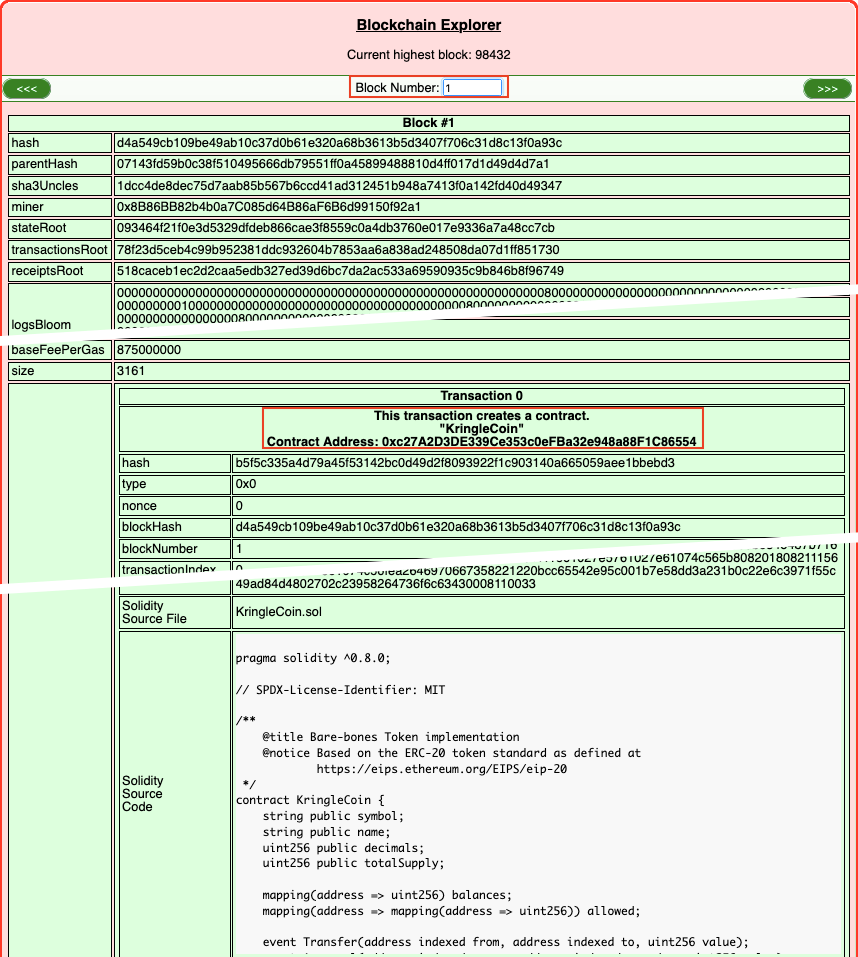

# Blockchain Divination

**Difficulty**: :fontawesome-solid-star::fontawesome-solid-star::fontawesome-solid-star::fontawesome-solid-star::fontawesome-regular-star: 
**Direct link**: [Blockchain Explorer website](https://prod-blockbrowser.kringle.co.in/)

## Objective

!!! question "Request"
    Use the Blockchain Explorer in the Burning Ring of Fire to investigate the contracts and transactions on the chain. At what address is the KringleCoin smart contract deployed? Find hints for this objective hidden throughout the tunnels.

??? quote "Slicmer"
    Don't bug me, kid. Luigi needs me to keep an eye on these offers you can't refute. 
    The boss told me to watch them for any shifty transactions from wallets that aren't on the pre-sale list. 
    He said to use this Block Explo... Exploder... thing. 
    With this, I can see all the movement of the uh... non-fungusable tokens. 
    Once on the blockchain, it's there forever for the whole world to see. 
    So if I spot anything that don't look right, I can let Luigi know, and Palzari will get to the bottom of it. 
    She looks sweet, but she's actually the boss' enforcer. Have you talked to her yet? She even scares me! 
    It sure would be fun to watch you get on her bad side. Heh heh.

## Hints

??? tip "Cryptopostage"
    Look at the transaction information. There is a *From:* address and a *To:* address. The *To:* address lists the address of the KringleCoin smart contract.

??? tip "A Solid Hint"
    Find a transaction in the blockchain where someone sent or received KringleCoin! The *Solidity Source File* is listed as `KringleCoin.sol`. [Tom's Talk](https://youtu.be/r3zj9DPC8VY) might be helpful!

## Solution

!!! note "What is a smart contract?"
    [Per IBM](https://www.ibm.com/topics/smart-contracts), *Smart contracts are simply programs stored on a blockchain that run when predetermined conditions are met. They typically are used to automate the execution of an agreement so that all participants can be immediately certain of the outcome, without any intermediary’s involvement or time loss. They can also automate a workflow, triggering the next action when conditions are met.*

When KringleCoin (KC) is transferred from one wallet to another, the logic in the KringleCoin smart contract is used to perform certain checks before executing the transfer. For example, the smart contract will most likely execute some logic that verifies that the sender has sufficient funds before allowing the transfer to proceed.

In addition, with blockchain technology every new block holds the hash of the previous block and thus new data is always added to the end of the blockchain. Since transferring KC between wallets requires the KringleCoin smart contract address and new blocks are added after existing blocks, the smart contract has to be located somewhere at the beginning of the blockchain.

Using the [Blockchain Explorer](https://prod-blockbrowser.kringle.co.in/), the very first block with number 0 is what's called the [Genesis Block](https://tecracoin.medium.com/what-is-genesis-block-and-why-genesis-block-is-needed-1b37d4b75e43) and is there so the next block is able to calculate and store block 0's hash value. As expected though, the next block holds the KringleCoin smart contract!

!!! note "Getting lucky"
    Because the Blockchain Explorer opens on the most recently added block by default, we might get lucky and land on a KringleCoin transaction when opening the website. If that's the case, the current block's *Solidity Source File* field will contain `KringleCoin.sol` and the smart contract address will be in the *To* field.

!!! success "Answer"
    `0xc27A2D3DE339Ce353c0eFBa32e948a88F1C86554`

## Response

!!! quote "Slicmer"
    ...
