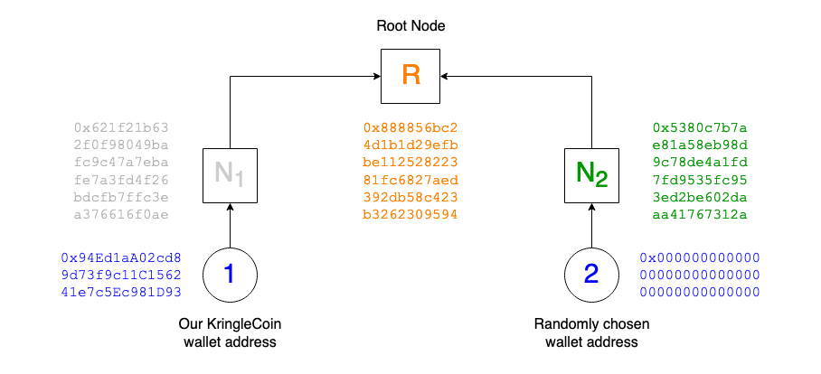

# Exploit a Smart Contract

**Difficulty**: :fontawesome-solid-star::fontawesome-solid-star::fontawesome-solid-star::fontawesome-solid-star::fontawesome-solid-star:<br/>
**Direct link**: [Bored Sporc Rowboat Society website](https://boredsporcrowboatsociety.com/)


## Objective

!!! question "Request"
    Exploit flaws in a smart contract to buy yourself a Bored Sporc NFT. Find hints for this objective hidden throughout the tunnels.

??? quote "Luigi"
    Psst. Hey, slick - over here. Myeah.<br/>
    You look like a sucker ahem I mean, savvy..<br/>
    I got some exclusive, very rare, very valuable NFTs for sale..<br/>
    But I run a KringleCoin-only business. Kapeesh?.<br/>
    Ever buy somethin' with cryptocurrency before?.<br/>
    Didn't think so, but if you wheel and deal with ya' pal Luigi here, now you can!.<br/>
    But we're currently in pre-sale, and you gotta be on the list. Myeah, see?.<br/>
    BSRS NFTs are a swell investment. They'll be worth a pretty penny, and that's a promise..<br/>
    So when they're purchasable, you better snatch 'em up before the other boneheads ahem I mean, eggheads do..<br/>
    I got a business to run. You can't buy nothin' right now, so scram. Kapeesh?


## Hints

??? tip "Merkle Tree Arboriculture"
    You're going to need a [Merkle Tree](https://decentralizedthoughts.github.io/2020-12-22-what-is-a-merkle-tree/) of your own. Math is hard. [Professor Petabyte](https://youtu.be/Qt_RWBq63S8) can help you out.

??? tip "Plant a Merkle Tree"
    You can change something that you shouldn't be allowed to change. [This repo](https://github.com/QPetabyte/Merkle_Trees) might help!


## Solution

### Finding the application flaw

??? info "Merkle trees, how *do* they work?"
    The second and third bullet points in the instructions on the [BSRS presale](https://boredsporcrowboatsociety.com/presale.html) page state that *very high-techy-techy* Merkle trees are being used to validate if someone's wallet address is on the approved list to buy a Bored Sporc NFT. To help understand what they are and how they can be applied to the use case of an NFT pre-order approval list, we can use Professor Qwerty Petabyte's [excellent explanation](https://github.com/QPetabyte/Merkle_Trees#merkle_trees) of the concept.

    In short, storing information in the blockchain is expensive. To work around this, Merkle tree root and leaf node values are calculated from the list of approved wallet addresses and only the root value is stored in the blockchain. Users on the approved list are then provided with a series of leaf node values called a proof which can be used in combination with the user's wallet address to calculate the root value. If the calculated root value matches the original value stored in the blockchain, the user is confirmed to be on the approved list.

The NFT presale is backed by the [`BSRS_nft.sol`](../artifacts/objectives/o16/BSRS_nft.sol) smart contract which we can find in block #2 on the blockchain. When we submit the form on the [BSRS presale](https://boredsporcrowboatsociety.com/presale.html) page, the leaf node value of our wallet address and proof are used as parameters for the smart contract's `verify` function. The function takes these values, calculates the Merkle tree root value, and then compares it to the root value which is also provided as a function parameter. All is well until we look at the client-side code though. The `do_presale` function in the [`bsrs.js`](../artifacts/objectives/o16/bsrs.js) JavaScript file not only submits our wallet address and proof, but it also sends along a root value. :thinking_face:

=== ":simple-javascript: JavaScript *do_presale* function"
    { class=border }

=== ":simple-solidity: Solidity *verify* function"
    { class=border }

In other words, the `verify` function in the `BSRS_nft.sol` smart contract isn't necessarily comparing its calculated Merkle tree root value to the root value of the actual list of approved wallet addresses. It's comparing to whatever root value is sent along when submitting the presale HTML form. Since we have control over the client-side JavaScript, this can be exploited by making the smart contract validate against the root value of a Merkle tree we generate ourselves.


### Validating the vulnerability

Using Professor Petabyte's [Python script](https://github.com/QPetabyte/Merkle_Trees) we can generate the smallest possible Merkle tree based on just two wallet addresses, our own personal wallet address and a randomly chosen value. As a result, the Merkle tree will only contain two leaf nodes and a root node. Start by cloning the repository using `git clone https://github.com/QPetabyte/Merkle_Trees.git` and replace the first item in the `allowlist` variable on line 149 with the wallet address we want to appear as being on the approved list.

{ class=border }

Next, run the script using `python merkle_tree.py` which will generate the Merkle tree values shown below.

{ class=border }

We can now validate the generated root (R) and proof (N2) by using our web browser's developer tools to first update the `root` variable in the `do_presale` function and then submitting our wallet hash (1) and generated proof (N2) via the HTML form on the BSRS presale page. Alternatively, we can use a tool like [curl](https://curl.se/) to manually submit the POST request to `/cgi-bin/presale`. As we're just testing, make sure to keep the *Validate Only* option checked or the `Validate` field set to *true* in the HTTP request.

{ class=border }

Looks like we successfully tricked the website into thinking we are on the allowed list. It's time to go shopping!


### Running the exploit

Just like when we [purchased our hat](./o14.md), we first need to use a [KTM](https://prod-ktm.kringle.co.in/) to approve a payment of 100 KC to the BSRS wallet address at `0xe8fC6f6a76BE243122E3d01A1c544F87f1264d3a`. Next, we head back to the BSRS presale page and repeat the steps from the validation phase by first changing the `root` variable in the `do_presale` JavaScript function to the value generated by the `merkle_tree.py` script (i.e., `0x888856bc24d1b1d29efbbe11252822381fc6827aed392db58c423b3262309594`).

{ class=border }

Finally, we enter our wallet address and the `0x5380c7b7ae81a58eb98d9c78de4a1fd7fd9535fc953ed2be602daaa41767312a` proof value generated by Professor Petabyte's `merkle_tree.py` script, uncheck the *Validate Only* option, and submit the form!

{ class=border }

The success message confirms we are now the proud and official owner of a [Bored Sporc NFT](../artifacts/objectives/o16/BSRS13.png)! :smile:

```json linenums="1" title="BSRS Token #000013"
{
    "name": "BSRS Token #000013",
    "description": "Official Bored Sporc Rowboat Society Sporc #000013",
    "image": "https://boredsporcrowboatsociety.com/TOKENS/TOKENIMAGES/BSRS13.png",
    "external_url": "https://boredsporcrowboatsociety.com/TOKENS/BSRS13",
    "token_id": 13
}
```

??? info "Blockchain transactions - Blocks #23207, #23219, and #23220"
    #### Block #23207 - Payment approval

    First, the details of the payment approval are stored in block #23207. This block holds the transaction from our personal wallet address to the `KringleCoin.sol` smart contract address where the `approve` function is called with the BSRS wallet address and 100 KringleCoin as input parameters. Go on, take our money!

    { class=border }


    #### Block #23219 - Transfer funds

    Next, block #23219 shows the transaction from the BSRS wallet address to the `KringleCoin.sol` smart contract address where the `transferFrom` function is called to transfer the approved 100 KringleCoin from our wallet to the BSRS wallet. If the exploit fails, we're out 100 KC and have nothing to show for it!

    { class=border }


    #### Block #23220 - Verification and NFT minting

    Last but not least, the NFT minting transaction is stored in block #23220. This block contains the transaction from the BSRS wallet address to the `BSRS_nft.sol` smart contract address where the `presale_mint` function is called with our wallet address, the generated proof, and the generated root as input parameters. The `presale_mint` function in turn calls the `verify` function to confirm our wallet address and proof add up to the root value we also submitted. The proof and root values are stored in the blockchain as bytes. We can convert them back to hex and confirm they are indeed the values we submitted.

    ```python linenums="1" title="Convert bytes to hex using Python"
    >>> b'\x88\x88V\xbc$\xd1\xb1\xd2\x9e\xfb\xbe\x11%("8\x1f\xc6\x82z\xed9-\xb5\x8cB;2b0\x95\x94'.hex()
    '888856bc24d1b1d29efbbe11252822381fc6827aed392db58c423b3262309594'
    >>> b'S\x80\xc7\xb7\xae\x81\xa5\x8e\xb9\x8d\x9cx\xdeJ\x1f\xd7\xfd\x955\xfc\x95>\xd2\xbe`-\xaa\xa4\x17g1*'.hex()
    '5380c7b7ae81a58eb98d9c78de4a1fd7fd9535fc953ed2be602daaa41767312a'
    ```

    { class=border }

!!! success "Answer"
    Buy a Bored Sporc NFT by exploiting a flaw in the smart contract.


## Response

!!! quote "Luigi"
    What!? How'd you get on the list? What's that? You's a double agent, and you're actually workin' for us?<br/>
    I don't know if I buy that, but you're on the list, so... myeah.<br/>
    Somethin' about this ain't sittin' right with me, but there's no reversing transactions with cryptocurrency.<br/>
    That NFT is yours to keep, but if I find out you're lyin' to me, Palzari's gonna pay you a visit. Kapeesh?

??? quote "Chorizo"
    *Well...I...never...*<br/>
    How was a plebeian such as yourself granted access to the pre-sale?<br/>
    I present thee with a proffer to purchase the NFT you've acquired for twice the price.<br/>
    Hwhat? You shan't vend to me? Have you any idea who I am?<br/>
    You just refused the abhorrent Count Chorizo!<br/>
    I shall ensure you are **nevah** able to transact with that NFT agayn!

??? quote "Slicmer"
    Hmph... this is so **boring**...<br/>
    "This is a serious task" he said, "not a sporc headbutting-party" he said.<br/>
    "Mess this up, Slicmer, and I'll tie a rock to your feet and throw you down a well!" he said.<br/>
    I think this job was just to keep me out of his way. Luigi thinks I'm a blockhead.<br/>
    Well I think *he's* a -- Huh? Wait a minute...<br/>
    Hey! Boss! I think I see somethin'!

??? quote "Palzari"
    Tsk tsk tsk, I thought I told you to play nice?<br/>
    The only reason you're not in time-out is because Luigi doesn't seem convinced that you're a little rascal.<br/>
    He's not as clever as he likes to think. But once he comes around...<br/>
    You better watch out, dear. And when I catch you, you better not cry. Or do, not even Santa will hear you.
