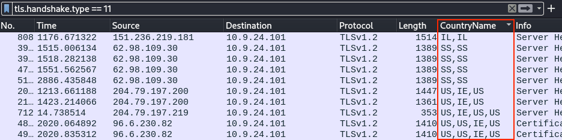
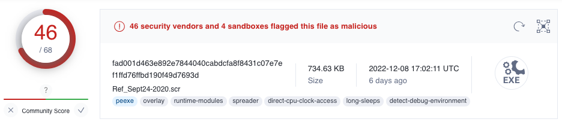

# Wireshark Practice

**Difficulty**: :fontawesome-solid-star::fontawesome-regular-star::fontawesome-regular-star::fontawesome-regular-star::fontawesome-regular-star:<br/>
**Direct link**: [wireshark terminal](https://hhc22-wetty.kringlecon.com/?&challenge=wireshark&id=71b0b8c5-e089-4281-95d7-dfe14c59e7c7)


## Objective

!!! question "Request"
    Use the Wireshark Phishing terminal in the Tolkien Ring to solve the mysteries around the [suspicious PCAP](https://storage.googleapis.com/hhc22_player_assets/suspicious.pcap). Get hints for this challenge by typing `hint` in the upper panel of the terminal.

??? quote "Sparkle Redberry"
    Hey there! I’m Sparkle Redberry. We have a bit of an incident here.<br/>
    We were baking lembanh in preparation for the holidays.<br/>
    It started to smell a little funky, and then suddenly, a Snowrog crashed through the wall!<br/>
    We're trying to investigate what caused this, so we can make it go away.<br/>
    Have you used Wireshark to look at packet capture (PCAP) files before?<br/>
    I've got [a PCAP](https://storage.googleapis.com/hhc22_player_assets/suspicious.pcap) you might find interesting.<br/>
    Once you've had a chance to look at it, please open this terminal and answer the questions in the top pane.<br/>
    Thanks for helping us get to the bottom of this!


## Solution

??? abstract "Welcome message"
    ```text
    This all started when I clicked on a link in my email.
    Can you help me?

    Task: Analyze the Wireshark file and Answer the Elf's Questions!
    To complete your task, download the file from your badge or use this
    command line to answer the questions.

    Tips:
    1. Each question may have hints. If you want another hint from the elf,
       just type hint in the upper pane.
    2. If you need help with Wireshark filters you can go here:
       https://wiki.wireshark.org/DisplayFilters
    3. If you need help with tshark filters, try this cheat sheet:
       https://cheatography.com/mbwalker/cheat-sheets/tshark-wireshark-command-line/
    4. Of course, SANS has lots of cheat sheets that can help:
       https://www.sans.org/blog/the-ultimate-list-of-sans-cheat-sheets/
    5. And remember, you can use Wireshark filters in tshark.
    ```


### Question 1

!!! question "Question"
    There are objects in the PCAP file that can be exported by Wireshark and/or Tshark. What type of objects can be exported from this PCAP?

Wireshark's `File > Export Objects` menu lists the different object types that can be exported from the [suspicious.pcap](../artifacts/objectives/o2/suspicious.pcap) file.

{ class=border }

Iterating over each menu entry shows that only the `HTTP...` submenu has several exportable objects.

!!! done "Answer"
    Answer: http


### Question 2

!!! question "Question"
    What is the file name of the largest file we can export?

The *HTTP object list* dialog provides the answer to this question. The `app.php` file is the largest file at 808 Kb.

{ class=border }

!!! done "Answer"
    `app.php`


### Question 3

!!! question "Question"
    What packet number starts that app.php file?

The answer to this question can again be found in the the *HTTP object list* dialog submenu, packet 687.

{ class=border }

!!! done "Answer"
    687


### Question 4

!!! question "Question"
    What is the IP of the Apache server?

Wireshark's [HTTP display filter documentation](https://www.wireshark.org/docs/dfref/h/http.html) tells us we can use `http.server == "Apache"` to find the proper IP address.


!!! done "Answer"
    192.185.57.242


### Question 5

!!! question "Question"
    What file is saved to the infected host?

Exporting the [`app.php`](../artifacts/objectives/o2/app.php) file using the *HTTP object list* dialog from questions 1 to 3 and looking at the JavaScript code shows a function call on line 68 to a `saveAs()` function which downloads the file as `Ref_Sept24-2020.zip`.


!!! done "Answer"
    `Ref_Sept24-2020.zip`


### Question 6

!!! question "Question"
    Attackers used bad TLS certificates in this traffic. Which countries were they registered to? Submit the names of the countries in alphabetical order separated by a commas (Ex: Norway, South Korea).

Certificate data is sent as part of TLS handshake packets of type 11. Using `tls` we can filter down the list to just those packets that contain certificate details. Selecting each of the packets and reviewing the packet details under the *Transport Layer Security* and *Certificate* nodes will tell us country information.


As there's still some legitimate traffic in the filtered packet list, going over every single entry one by one, expanding the nodes, and finding the country code can be tedious. A quicker solution is to find one entry with the proper information, right-clicking on the node and selecting *Apply as Column* from the context menu.



Four countries are found in the certificate data: US, IE, IL, and SS. Inspecting the packet details shows that the US entries belong to Microsoft-issued certificates. The IL (Israel) and SS (South Sudan) entries on the other hand look a lot more suspicious with subject names like `heardbellith.Icanwepeh.nagoya` and `psprponoust.aquarelle`.

!!! done "Answer"
    Israel, South Sudan


### Question 7

!!! question "Question"
    Is the host infected (Yes/No)?

It sounds like someone fell for a pishing attack. Clicking the link triggered a request for the [`app.php`](../artifacts/objectives/o2/app.php) script after which `Ref_Sept24-2020.zip` was automatically downloaded. Unpacking `Ref_Sept24-2020.zip` and executing the embedded malicious `Ref_Sept24-2020.scr` binary then caused the host to start communicating with the suspicious IL and SS servers.

Since the `app.php` file contains JavaScript code, we can rename the file to `app.html` and open it in a web browser **in a sandboxed environment**. This will trigger the download of the embedded [`Ref_Sept24-2020.zip`](../artifacts/objectives/o2/Ref_Sept24-2020.zip) file data. Extracting the file, calculating its SHA256 hash using `shasum -a 256 Ref_Sept24-2020.scr`, and searching for the hash in [VirusTotal](https://www.virustotal.com/gui/file/fad001d463e892e7844040cabdcfa8f8431c07e7ef1ffd76ffbd190f49d7693d) show that quite a few AntiVirus scanners flag the file as malicious. With analysis results referring to Cridex and Dridex, this likely is a banking trojan!

{ class=border }

!!! done "Answer"
    Yes

!!! note "Extracting the answers from the */opt/elf* binary<span id="cheating"></span>"

    If putting in the time and effort to learn about `wireshark` or `tshark` isn't your thing, then you're in luck! Someone was nice enough to leave a copy of [`pyi-archive_viewer`](https://pyinstaller.readthedocs.io/en/stable/advanced-topics.html#using-pyi-archive-viewer) in `/usr/local/bin` which you can use to inspect and extract data from executables created with [PyInstaller](https://pyinstaller.readthedocs.io/en/stable/), like `/opt/elf`. This binary is run through tmux and is responsible for verifying the answers entered in the top pane.

    

    Start by using `pyi-archive_viewer /usr/bin/quizme` to view all available components in the `elf` binary.

    

    Next, extract the `elf` component and save it to `elf.bin` using `x elf`.

    

    Finally, use `strings elf.bin | less` to show the answers from the `elf.bin` file. :joy:

    


## Response

!!! quote "Sparkle Redberry"
    You got it - wonderful!<br/>
    So hey, when you're looking at the next terminal, remember you have multiple filetypes and tools you can utilize.<br/>
    Conveniently for us, we can use programs already installed on every Windows computer.<br/>
    So if you brought your own Windows machine, you can save the files to it and use whatever method is your favorite.<br/>
    Oh yeah! If you wanna learn more, or get stuck, I hear [Eric Pursley's talk](https://youtu.be/5NZeHYPMXAE) is about this very topic.
