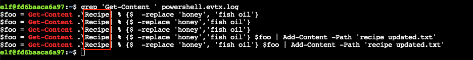
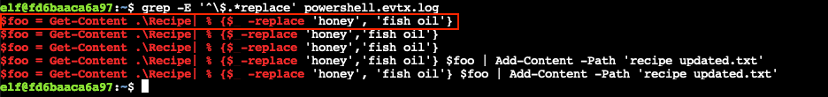
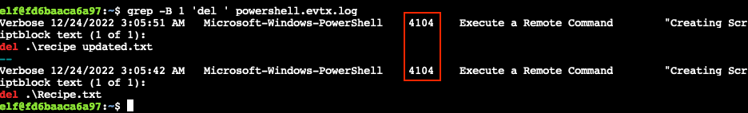
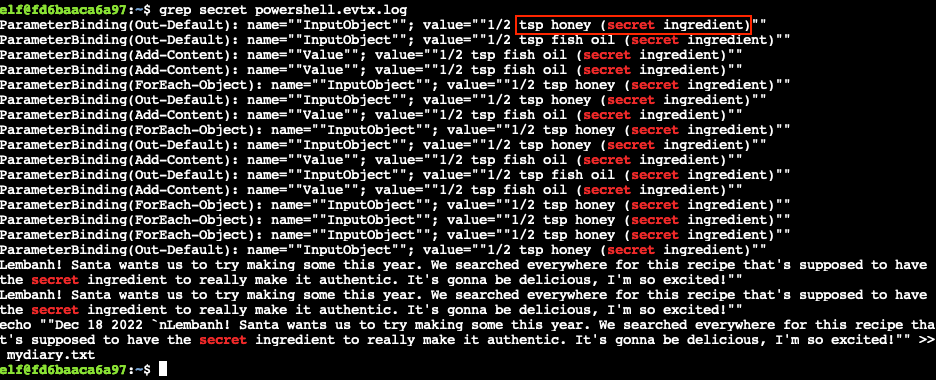

# Windows Event Logs

**Difficulty**: :fontawesome-solid-star::fontawesome-solid-star::fontawesome-regular-star::fontawesome-regular-star::fontawesome-regular-star: 
**Direct link**: [Event Logs terminal](https://hhc22-wetty.kringlecon.com/?&challenge=eventlogs)

## Objective

!!! question "Request"
    Investigate the Windows [event log](https://storage.googleapis.com/hhc22_player_assets/powershell.evtx) mystery in the terminal or offline. Get hints for this challenge by typing `hint` in the upper panel of the Windows Event Logs terminal.

??? quote "Dust Giftwrap"
    Hi! I'm Dusty Giftwrap! 
    We think the Snowrog was attracted to the pungent smell from the baking lembanh. 
    I'm trying to discover which ingredient could be causing such a stench. 
    I think the answer may be in these suspicious logs. 
    I'm focusing on Windows Powershell logs. Do you have much experience there? 
    You can work on this [offline](https://storage.googleapis.com/hhc22_player_assets/powershell.evtx) or try it in this terminal. 
    Golly, I'd apprecaite it if you could take a look.

## Hints

??? hint "Built-In hints"
    The hardest steps in this challenge have hints. Just type `hint` in the top panel!

??? hint "Event Logs Expose"
    New to Windows event logs? Get a jump start with [Eric's talk](https://youtu.be/5NZeHYPMXAE)!

## Solution

??? abstract "Welcome message"
    Grinchum successfully downloaded his keylogger and has gathered the admin credentials! 
    We think he used PowerShell to find the Lembanh recipe and steal our secret ingredient. 
    Luckily, we enabled PowerShell auditing and have exported the Windows PowerShell logs to a flat text file. 
    Please help me analyze this file and answer my questions. 
    Ready to begin? 

    Task: Analyze the PowerShell Event Log And Answer the Elf's Questions! 
    To help you complete your task, download the file from Dusty Giftwrap or use the command line to answer the questions.

    Tips:

    1. `grep` is a very useful tool when completing terminal challenges.
    2. Keep [this link](https://linuxcommand.org/lc3_man_pages/grep1.html) handy
    3. Each question may have hints. If you want another hint from the elf, just type `hint` in the upper pane.

!!! note "I don't wanna learn about PowerShell logs!"
    Similar to the [Wireshark Practice](./o2.md) challenge, the answers can also be [extracted](#cheating) from the `/opt/elf` binary!

### Question 1

!!! question "Question"
    What month/day/year did the attack take place? For example, 09/05/2021.

To answer this question we need to find any dates in the [`powershell.evtx`](../artifacts/objectives/o3/powershell.evtx) log which are present on more lines than others, indicating these dates had more activity than usual. We first `grep` for patterns that match a date, `sort` them so they are neatly sorted together, count each set using `uniq -c`, and finally use `sort -r` to display from highest to lowest count. Our final command looks like: [`grep -oE "([0-9]{2}/[0-9]{2}/[0-9]{4})" powershell.evtx.log | sort | uniq -c | sort -r`](https://explainshell.com/explain?cmd=grep+-oE+%22%28%5B0-9%5D%7B2%7D%2F%5B0-9%5D%7B2%7D%2F%5B0-9%5D%7B4%7D%29%22+powershell.evtx.log+%7C+sort+%7C+uniq+-c+%7C+sort+-r).

{ class=border }

!!! done "Answer"
    12/24/2022

### Question 2

!!! question "Question"
    An attacker got a secret from a file. What was the original file's name?

[PowerShell](https://devblogs.microsoft.com/scripting/table-of-basic-powershell-commands/) provides a `Get-Content` command which reads the contents of a file. While we can simply `grep` for *Get-Content*, the output still contains a little too much noise which we can remove by simply adding a space at the end of our search string: [`grep 'Get-Content ' powershell.evtx.log`](https://explainshell.com/explain?cmd=grep+%27Get-Content+%27+powershell.evtx.log). The output contains references to a file named `Recipe`.

{ class=border }

!!! done "Answer"
    `Recipe`

### Question 3

!!! question "Question"
    The contents of the previous file were retrieved, changed, and stored to a variable by the attacker. This was done multiple times. Submit the last full PowerShell line that performed only these actions.

While the previous output provides the answer to this question as well, we can also use [`grep -E '^\$.*replace' powershell.evtx.log`](https://explainshell.com/explain?cmd=grep+-E+%27%5E%5C%24.*replace%27+powershell.evtx.log) to search for lines beginning with *$*, indicating the start of a PowerShell variable name, in combination with *replace* to find the change activity. Since the log entries are listed from newest to oldest, the first *correct* PowerShell command that only matches the retrieve/change/store actions is the top entry.

{ class=border }

!!! done "Answer"
    `$foo = Get-Content .\Recipe| % {$_ -replace 'honey', 'fish oil'}`

### Question 4

!!! question "Question"
    After storing the altered file contents into the variable, the attacker used the variable to run a separate command that wrote the modified data to a file. This was done multiple times. Submit the last full PowerShell line that performed only this action.

Adding content to a file using [PowerShell]((https://devblogs.microsoft.com/scripting/table-of-basic-powershell-commands/)) is done via the `Add-Content` command. So, we use [`grep -E '^\$.*Add-Content' powershell.evtx.log`](https://explainshell.com/explain?cmd=grep+-E+%27%5E%5C%24.*Add-Content%27+powershell.evtx.log) to perform a search for entries that start with a PowerShell variable name and also contain the *Add-Content* string. The top line in the result is the most recent entry that only performed this action.

{ class=border }

!!! done "Answer"
    `$foo | Add-Content -Path 'Recipe'`

### Question 5

!!! question "Question"
    The attacker ran the previous command against a file multiple times. What is the name of this file?

The output from [`grep -E '^\$.*Add-Content' powershell.evtx.log`](https://explainshell.com/explain?cmd=grep+-E+%27%5E%5C%24.*Add-Content%27+powershell.evtx.log) also provides the answer to this question. The previous command was run against multiple times against a file named `Recipe.txt`.

{ class=border }

!!! done "Answer"
    `Recipe.txt`

### Question 6

!!! question "Question"
    Were any files deleted (Yes/No)?

There are multiple ways to delete a file in [PowerShell]((https://devblogs.microsoft.com/scripting/table-of-basic-powershell-commands/)): `Remove-Item`, `ri`, `del`, and `rm`. Searching for *del* using [`grep 'del ' powershell.evtx.log`](https://explainshell.com/explain?cmd=grep+%27del+%27+powershell.evtx.log) provides us with evidence of `Recipe.txt` and `recipe_updated.txt` being deleted.

{ class=border }

!!! done "Answer"
    Yes

### Question 7

!!! question "Question"
    Was the original file (from question 2) deleted? (Yes/No)

Command output from question 2 and question 6 tell us that the `Recipe` file was **not** deleted.

!!! done "Answer"
    No

### Question 8

!!! question "Question"
    What is the Event ID of the log that shows the actual command line used to delete the file?

Changing he previous `grep` command to [`grep -B 1 'del ' powershell.evtx.log`](https://explainshell.com/explain?cmd=grep+-B+1+%27del+%27+powershell.evtx.log) will not only print the lines that match our search string, but also the line before it which contains the requested event ID. Similarly, `-A 1` can also be used to print one additional line after each matching log entry. Increasing the number will output more information.

{ class=border }

!!! done "Answer"
    4104

### Question 9

!!! question "Question"
    Is the secret ingredient compromised (Yes/No)?

From questions 2 and 3 we know `Recipe` was read and *honey* was replaced with *fish oil*. From question 4 we know the modified data stored in the `$foo` variable was then written back to the `Recipe` file. If we `grep` the log for *secret* using [`grep secret powershell.evtx.log`](https://explainshell.com/explain?cmd=grep+secret+powershell.evtx.log), we can see that the entries for the original *honey* ingredient had *(secret ingredient)* noted beside it.

{ class=border }

!!! done "Answer"
    Yes

### Question 10

!!! question "Question"
    What is the secret ingredient?

Command output from questions 2 and 3 tells us that the secret ingredient *honey* was replaced with *fish oil*.

!!! done "Answer"
    honey

!!! note "Extracting the answers from the `/opt/elf` binary... again"
    The same [`pyi-archive_viewer`](https://pyinstaller.readthedocs.io/en/stable/advanced-topics.html#using-pyi-archive-viewer) technique that was used previously can be leveraged here as well. For details, see the [Wireshark Practice](./o2.md#cheating) challenge.

    { class=border }

## Response

!!! quote "Dust Giftwrap"
    Say, you did it! Thanks a million! 
    Now we can mix in the proper ingredients and stop attracting the Snowrog! 
    I'm all set now! Can you help Fitzy over there wield the exalted Suricata? 
    It can be a bit mystifying at first, but this [Suricata Tome](https://suricata.readthedocs.io/en/suricata-6.0.0/rules/intro.html) should help you fathom it. 
    I sure hope you can make it work!
