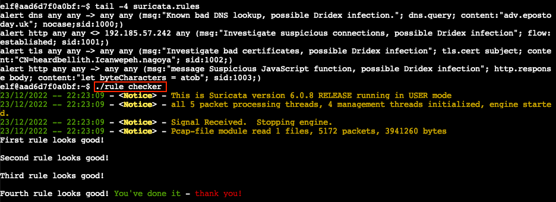

# Suricata Regatta

**Difficulty**: :fontawesome-solid-star::fontawesome-solid-star::fontawesome-solid-star::fontawesome-regular-star::fontawesome-regular-star: 
**Direct link**: [suricata terminal](https://hhc22-wetty.kringlecon.com/?&challenge=suricata&id=a541998b-e466-4aca-91e7-26ae2f9ab78b)

## Objective

!!! question "Request"
    Help detect this kind of malicious activity in the future by writing some Suricata rules. Work with Dusty Giftwrap in the Tolkien Ring to get some hints.

??? quote "Fitzy Shortstack"
    Hm?.. Hello... 
    Sorry, I don't mean to be uncharaceristically short with you. 
    There's just this abominable Snowrog here, and I'm trying to comprehend Suricata to stop it from getting into the kitchen. 
    I believe that if I can phrase these Suricata incantations correctly, they'll create a spell that will generate warnings. 
    And hopefully those warnings will scare off the Snowrog! 
    Only... I'm quite baffled. Maybe you can give it a go?

## Hints

??? hint "The Tome of Suricata Rules"
    [This](https://suricata.readthedocs.io/en/suricata-6.0.0/rules/intro.html) is the official source for Suricata rule creation!

## Solution

??? abstract "Welcome message"
    Use your investigative analysis skills and the `suspicious.pcap` file to help develop Suricata rules for the elves!

    There's a short list of rules started in `suricata.rules` in your home directory.

    First off, the STINC (Santa's Team of Intelligent Naughty Catchers) has a lead for us. 
    They have some Dridex indicators of compromise to check out. 
    First, please create a Suricata rule to catch DNS lookups for *adv.epostoday.uk*. 
    Whenever there's a match, the alert message (msg) should read *Known bad DNS lookup, possible Dridex infection*. 
    Add your rule to `suricata.rules`

    Once you think you have it right, run `./rule_checker` to see how you've done! 
    As you get rules correct, rule_checker will ask for more to be added.

    If you want to start fresh, you can `exit` the terminal and start again or `cp suricata.rules.backup suricata rules` 
    Good luck, and thanks for helping save the North Pole!

### Rule 1 - DNS

!!! question "Question"
    First, please create a Suricata rule to catch DNS lookups for *adv.epostoday.uk*. Whenever there's a match, the alert message (msg) should read *Known bad DNS lookup, possible Dridex infection*.

We can use the official [Suricata documentation](https://suricata.readthedocs.io/en/suricata-6.0.0/rules/intro.html) to help with building these rules. For the first rule we need to [`alert`](https://suricata.readthedocs.io/en/suricata-6.0.0/rules/intro.html#action) on [`dns`](https://suricata.readthedocs.io/en/suricata-6.0.0/rules/intro.html#protocol) protocol traffic between `any` source and destination IP address and port, where the [`dns.query`](https://suricata.readthedocs.io/en/suricata-6.0.0/rules/dns-keywords.html) contains *adv.epostoday.uk*. We can add `nocase` to make the match behave in a case-insensitive manner. Don't forget to also add a unique `sid` identifier to each rule.

| Field        | Value                                                 |
| :----------- | :---------------------------------------------------- |
| Action       | `alert`                                               |
| Protocol     | `dns`                                                 |
| Traffic flow | `any any -> any any`                                  |
| Keywords     | `dns.query; content:"adv.epostoday.uk"; nocase;;`     |
| Message      | `"Known bad DNS lookup, possible Dridex infection.";` |
| Identifier   | `sid:1000;`                                           |

!!! done "Answer"
    `alert dns any any -> any any (msg:"Known bad DNS lookup, possible Dridex infection."; dns.query; content:"adv.epostoday.uk"; nocase; sid:1000;)`

### Rule 2 - HTTP

!!! question "Question"
    Develop a Suricata rule that alerts whenever the infected IP address 192.185.57.242 communicates with internal systems over HTTP. When there's a match, the message (msg) should read *Investigate suspicious connections, possible Dridex infection*.

This rule needs to be a little more specific regarding the IP addresses involved in the connection. We need to [`alert`](https://suricata.readthedocs.io/en/suricata-6.0.0/rules/intro.html#action) on [`http`](https://suricata.readthedocs.io/en/suricata-6.0.0/rules/intro.html#protocol) protocol traffic between `any` port on malicious IP address 192.185.57.242 and `any` IP address and port where the network connection was effectively [`established`](https://suricata.readthedocs.io/en/suricata-6.0.0/rules/flow-keywords.html#flow).

| Field        | Value                                                              |
| :----------- | :----------------------------------------------------------------- |
| Action       | `alert`                                                            |
| Protocol     | `http`                                                             |
| Traffic flow | `any any <> 192.185.57.242 any`                                    |
| Keywords     | `flow:established;`                                                |
| Message      | `"Investigate suspicious connections, possible Dridex infection";` |
| Identifier   | `sid:1001;`                                                        |

!!! done "Answer"
    `alert http any any <> 192.185.57.242 any (msg:"Investigate suspicious connections, possible Dridex infection"; flow:established; sid:1001;)`

### Rule 3 - TLS

!!! question "Question"
    We heard that some naughty actors are using TLS certificates with a specific CN. Develop a Suricata rule to match and alert on an SSL certificate for *heardbellith.Icanwepeh.nagoya*. When your rule matches, the message (msg) should read *Investigate bad certificates, possible Dridex infection*

Stepping it up just a notch, we now need to [`alert`](https://suricata.readthedocs.io/en/suricata-6.0.0/rules/intro.html#action) on [`tls`](https://suricata.readthedocs.io/en/suricata-6.0.0/rules/intro.html#protocol) protocol traffic between `any` source and `any` destination where the [`tls.cert_subject`](https://suricata.readthedocs.io/en/suricata-6.0.0/rules/tls-keywords.html#tls-cert-subject) contains the Common Name (CN) *heardbellith.Icanwepeh.nagoya*. Similar to the first rule, we can add `nocase` to make the CN search case-insensitive, but the rule will work either way.

| Field        | Value                                                           |
| :----------- | :-------------------------------------------------------------- |
| Action       | `alert`                                                         |
| Protocol     | `tls`                                                           |
| Traffic flow | `any any -> any any`                                            |
| Keywords     | `tls.cert_subject; content:"CN=heardbellith.Icanwepeh.nagoya";` |
| Message      | `"Investigate bad certificates, possible Dridex infection";`    |
| Identifier   | `sid:1002;`                                                     |

!!! done "Answer"
    `alert tls any any -> any any (msg:"Investigate bad certificates, possible Dridex infection"; tls.cert_subject; content:"CN=heardbellith.Icanwepeh.nagoya"; sid:1002;)`

### Rule 4 - JavaScript

!!! question "Question"
    OK, one more to rule them all and in the darkness find them. Let's watch for one line from the JavaScript: *let byteCharacters = atob*. Oh, and that string might be GZip compressed - I hope that's OK! Just in case they try this again, please alert on that HTTP data with message *Suspicious JavaScript function, possible Dridex infection*

First, let's take a quick moment to appreciate the Lord of the Rings reference here. Just like the second rule, our final rule also needs to [`alert`](https://suricata.readthedocs.io/en/suricata-6.0.0/rules/intro.html#action) on [`http`](https://suricata.readthedocs.io/en/suricata-6.0.0/rules/intro.html#protocol) traffic, but this time we need to match on HTTP traffic between `any` source and `any` destination, where the [`http.response_body`](https://suricata.readthedocs.io/en/suricata-6.0.0/rules/http-keywords.html#http-response-body) contains the `let byteCharacters = atob` JavaScript code snippet.

| Field        | Value                                                          |
| :----------- | :------------------------------------------------------------- |
| Action       | `alert`                                                        |
| Protocol     | `http`                                                         |
| Traffic flow | `any any -> any any`                                           |
| Keywords     | `http.response_body; content:"let byteCharacters = atob";`     |
| Message      | `"Suspicious JavaScript function, possible Dridex infection";` |
| Identifier   | `sid:1003;`                                                    |

!!! done "Answer"
    `alert http any any -> any any (msg:"Suspicious JavaScript function, possible Dridex infection"; http.response_body; content:"let byteCharacters = atob"; sid:1003;)`

Adding these 4 rules to the [`suricata.rules`](../artifacts/objectives/o4/suricata.rules) file and running `./rule_checker` confirms our solution is correct! :metal:

{ class=border }

## Response

!!! quote "Fitzy Shortstack"
    Woo hoo - you wielded Suricata magnificently! Thank you! 
    Now to shout the final warning of power to the Snowrog... 
    YOU...SHALL NOT...PASS!!! 
