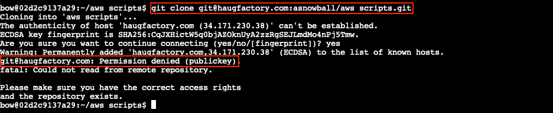
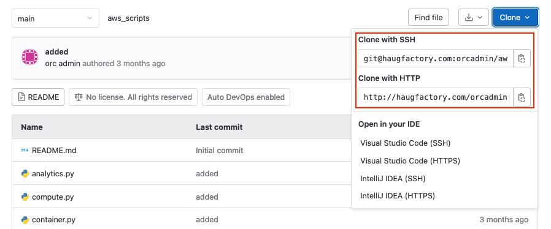
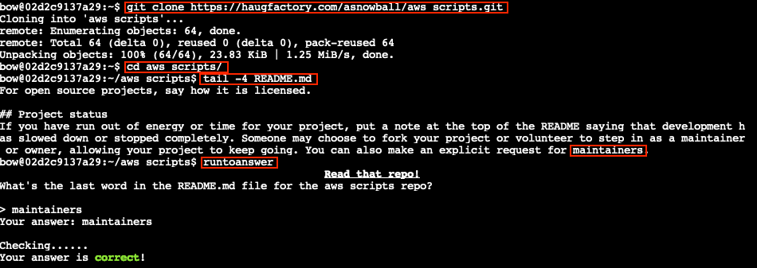

# Clone with a Difference

**Difficulty**: :fontawesome-solid-star::fontawesome-regular-star::fontawesome-regular-star::fontawesome-regular-star::fontawesome-regular-star:<br/>
**Direct link**: [Intro terminal](https://hhc22-wetty.kringlecon.com/?&challenge=intro)


## Objective

!!! question "Request"
    Clone a code repository. Get hints for this challenge from Bow Ninecandle in the Elfen Ring.

??? quote "Bow Ninecandle"
    Well hello! I'm Bow Ninecandle!<br/>
    Have you ever used Git before? It's so neat!<br/>
    It adds so much convenience to DevOps, like those times when a new person joins the team.<br/>
    They can just clone the project, and start helping out right away!<br/>
    Speaking of, maybe you could help me out with cloning this repo?<br/>
    I've heard there's multiple methods, but I only know how to do one.<br/>
    If you need more help, check out the [panel of very senior DevOps experts](https://youtu.be/vIQY_FH1SVk).


## Hints

??? hint "HTTPS Git Cloning"
    There's a consistent format for Github repositories cloned [via HTTPS](https://github.com/git-guides/git-clone). Try converting!


## Solution

??? abstract "Welcome message"
    ```text
    We just need you to clone one repo:
    'git clonegit@haugfactory.com:asnowball/aws_scripts.git'
    This should be easy, right?

    Thing is: it doesn't seem to be working for me.
    This is a 'public' repository though. I'm so confused!

    Please clone the repo and 'cat' the 'README.md' file.
    Then 'runtoanswer' and tell us the last word of the README.md file!
    ```

Some of the challenges are designed to help you get acquainted with a specific technology or tool. In [previous](https://n00.be/HolidayHackChallenge2021/hints/h2/) [years](https://n00.be/HolidayHackChallenge2020/hints/h2/), hint terminals were separate from the main objectives. This year however, for the first time, they're much more integrated into the main storyline. For this objective, we need to familiarize ourselves with Git, in preparation for the [Jolly CI/CD](./o7.md) objective.

Trying to clone the repository using `git clone git@haugfactory.com:asnowball/aws_scripts.git` will throw an error stating *Permission denied (publickey)*, indicating our SSH key located at `/home/bow/.ssh/id_rsa` isn't accepted. Since Bow notes that this is a public repository, we don't really need to clone via SSH and we should be able to use HTTPS instead.

{ class=border }

Using [the hint](https://github.com/git-guides/git-clone) and rewriting the Git URL as [https://haugfactory.com/asnowball/aws_scripts.git](https://haugfactory.com/asnowball/aws_scripts.git) allows us to successfully clone the repository using `git clone https://haugfactory.com/asnowball/aws_scripts.git`. We can also verify that the URL is correct by browsing to it, which will bring up a GitLab web interface for the Git repository.


{ class=border }

Once cloned, `cd` into the `aws_scripts` folder, find the last word in the `README.md` file, and submit it using `runtoanswer`.

{ class=border }

!!! success "Answer"
    maintainers


## Response

!!! quote "Bow Ninecandle"
    Wow - great work! Thank you!<br/>
    Say, if you happen to be testing containers for security, there are some things you should think about.<br/>
    Developers love to give ALL TeH PERMz so that things "just work," but it can cause real problems.<br/>
    It's always smart to check for excessive user and container permissions.<br/>
    You never know! You might be able to interact with host processes or filesystems!
