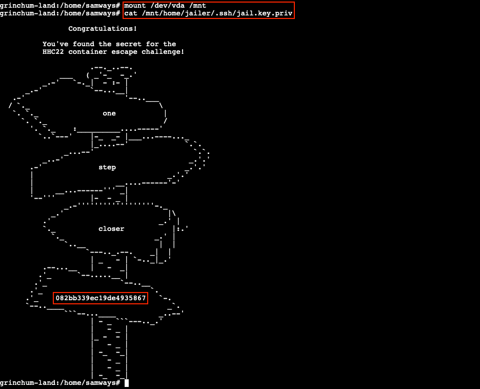

# Prison Escape

**Difficulty**: :fontawesome-solid-star::fontawesome-solid-star::fontawesome-solid-star::fontawesome-regular-star::fontawesome-regular-star:<br/>
**Direct link**: [Escape terminal](https://hhc22-escapeh.kringlecon.com/?&challenge=escape)


## Objective

!!! question "Request"
    Escape from a container. Get hints for this challenge from Bow Ninecandle in the Elfen Ring. What hex string appears in the host file `/home/jailer/.ssh/jail.key.priv`?

??? quote "Tinsel Upatree"
    Hiya hiya, I'm Tinsel Upatree!<br/>
    Check me out, I'm working side-by-side with a real-life Flobbit. Epic!<br/>
    Anyway, would ya' mind looking at this terminal with me?<br/>
    It takes a few seconds to start up, but then you're logged into a super secure container environment!<br/>
    Or maybe it isn't so secure? I've heard about container escapes, and it has me a tad worried.<br/>
    Do you think you could test this one for me? I'd appreciate it!


## Hints

??? hint "Over-Permissioned"
    When users are over-privileged, they can often act as root. When containers have too many [permissions](https://learn.snyk.io/lessons/container-runs-in-privileged-mode/kubernetes/), they can affect the host!

??? hint "Mount Up and Ride"
    Were you able to `mount` up? If so, users' `home/` directories can be a great place to look for secrets...


## Solution

??? abstract "Welcome message"
    Greetings Noble Player,

    You find yourself in a jail with a recently captured Dwarven Elf.

    He desperately asks your help in escaping for he is on a quest to aid a friend in a search for treasure inside a crypto-mine.

    If you can help him break free of his containment, he claims you would receive "MUCH GLORY!"

    Please, do your best to un-contain yourself and find the keys to both of your freedom.

As with many CTFs and real life pentesting engagements, everything starts with some good reconnaissance. Having a solid understanding of the environment we're trying to break into, or in this particular case break out of, is crucial. From a permissions perspective we can verify if there are any elevated permissions we've been granted using `sudo -l`. This tells us that our user *samways* is allowed to run any command as the *root* account. We can either prepend `sudo` to every command going forward or simply use `sudo su` to drop into a privileged root shell.

{ class=border }

Based on the hint referencing the `mount` command and the request to read a file stored on the host file system, we can check if any block storage devices are available to *mount* or connect to our container. `lsblk` is typically used to list this information, but that particular command isn't available. Instead, we can use `fdisk -l` or `find /dev -type b`.

{ class=border }

[Mounting](https://www.simplified.guide/linux/disk-mount) the `/dev/vda` block device to the `/mnt` folder using the command `mount /dev/vda /mnt` will make the content of the storage device accessible in our container and allows us to access the hex string via `cat /mnt/home/jailer/.ssh/jail.key.priv`.

{ class=border }

Channeling our inner [Captain Hindsight](https://southpark.fandom.com/wiki/Captain_Hindsight), solving this challenge really only requires 2 commands:

```bash linenums="1" title="Terminal commands to solve the challenge"
sudo mount /dev/vda /mnt  # mount /dev/vda to /mnt
cat /mnt/home/jailer/.ssh/jail.key.priv  # print the hex string
```

!!! done "Answer"
    082bb339ec19de4935867


## Response

!!! quote "Tinsel Upatree"
    Great! Thanks so much for your help!<br/>
    Now that you've helped me with this, I have time to tell you about the deployment tech I've been working on!<br/>
    Continuous Integration/Continuous Deployment pipelines allow developers to iterate and innovate quickly.<br/>
    With this project, once I push a commit, a GitLab runner will automatically deploy the changes to production.<br/>
    WHOOPS! I didn’t mean to commit that to `http://gitlab.flag.net.internal/rings-of-powder/wordpress.flag.net.internal.git`...<br/>
    Unfortunately, if attackers can get in that pipeline, they can make an awful mess of things!
