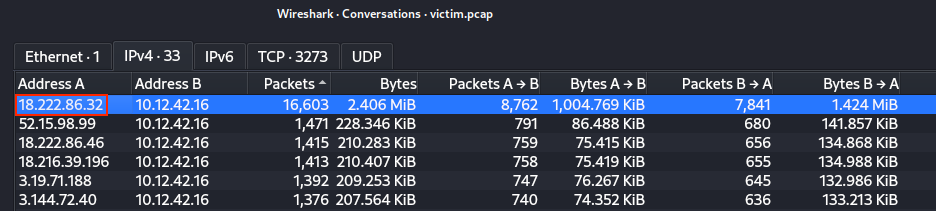
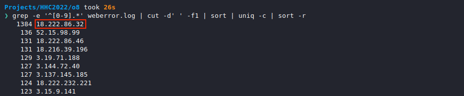
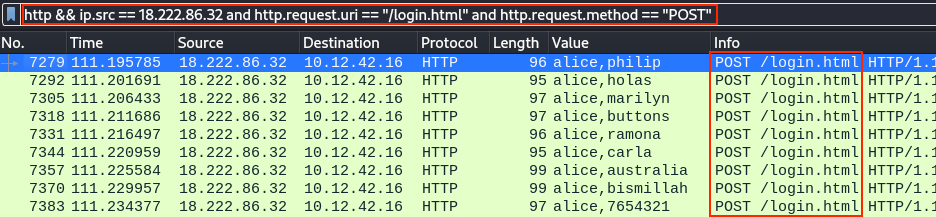
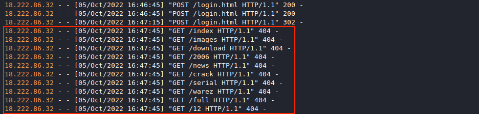
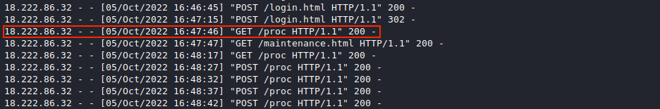
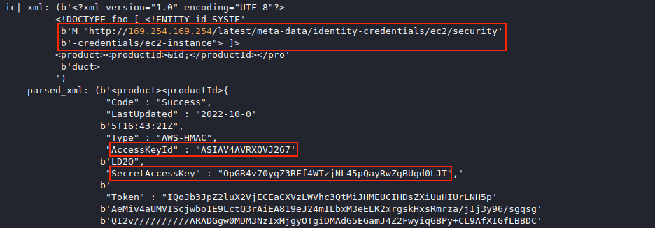

# Boria PCAP Mining

**Difficulty**: :fontawesome-solid-star::fontawesome-solid-star::fontawesome-regular-star::fontawesome-regular-star::fontawesome-regular-star: 
**Direct link**: [boriaArtifacts.zip](https://storage.googleapis.com/hhc22_player_assets/boriaArtifacts.zip)

## Objective

!!! question "Request"
    Use [the artifacts](https://storage.googleapis.com/hhc22_player_assets/boriaArtifacts.zip) from Alabaster Snowball to analyze this attack on the Boria mines.

??? quote "Alabaster Snowball"
    Hey there! I'm Alabaster Snowball 
    And I have to say, I'm a bit distressed. 
    I was working with the dwarves and their Boria mines, and I found some disturbing activity! 
    Looking through [these artifacts](https://storage.googleapis.com/hhc22_player_assets/boriaArtifacts.zip), I think something naughty's going on. 
    Can you please take a look and answer a few questions for me? 
    First, we need to know where the attacker is coming from. 
    If you haven't looked at Wireshark's *Statistics* menu, this might be a good time!

## Hints

??? hint "Wireshark Top Talkers"
    The victim web server is 10.12.42.16. Which host is the next [top talker](https://protocoholic.com/2018/05/24/wireshark-how-to-identify-top-talkers-in-network/)?

??? hint "Wireshark String Searching"
    The site's login function is at `/login.html`. Maybe start by [searching](https://www.wireshark.org/docs/wsug_html_chunked/ChWorkFindPacketSection.html) for a *string*.

??? hint "Status Codes"
    With forced browsing, there will be many *404* status codes returned from the web server. Look for *200* codes in that group of *404*s. This one can be completed with the PCAP or the log file.

??? hint "Instance Metadata Service"
    AWS uses a specific IP address to access [IMDS](https://www.sans.org/blog/cloud-instance-metadata-services-imds-/), and that IP only appears twice in this PCAP.

## Solution

### Naughty IP

!!! question "Question"
    Most of the traffic to this site is nice, but one IP address is being naughty! Which is it? Visit Sparkle Redberry in the Tolkien Ring for hints.

Unpack the [`boriaArtifacts.zip`](../artifacts/objectives/o8/boriaArtifacts.zip) archive and open the [`victim.pcap`](../artifacts/objectives/o8/boriaArtifacts/victim.pcap) packet capture in [Wireshark](https://www.wireshark.org/). Open the *Statistics > Conversations* menu and sort by *Packets* on the *IPv4* tab. This tells us that 18.222.86.32 was the most chatty external host.

{ class=border }

We can confirm this by extracting and counting all unique IP addresses from the [`weberror.log`](../artifacts/objectives/o8/boriaArtifacts/weberror.log) file using [`grep -e '^[0-9].*' weberror.log | cut -d' ' -f1 | sort | uniq -c | sort -r`](https://explainshell.com/explain?cmd=grep+-e+%27%5E%5B0-9%5D.*%27+weberror.log+%7C+cut+-d%27+%27+-f1+%7C+sort+%7C+uniq+-c+%7C+sort+-r). The same IP address is at the top of the list here as well.

{ class=border }

!!! done "Answer"
    18.222.86.32

??? quote "Alabaster Snowball"
    Aha, you found the naughty actor! Next, please look into the account brute force attack. 
    You can focus on requests to `/login.html~`

### Credential Mining

!!! question "Question"
    The first attack is a [brute force](https://owasp.org/www-community/attacks/Brute_force_attack) login. What's the first username tried?

Now that we have our malicious IP address, we can use the Wireshark display filter `http && ip.src == 18.222.86.32 and http.request.uri == "/login.html" and http.request.method == "POST"` to only show HTTP POST requests made by host 18.222.86.32 against the `/login.html` login page.

{ class=border }

The *HTML Form* data for each HTTP POST request shows the submitted username and password values, which is *alice* for the first set of brute force login attempts. Right-clicking on the username *Value* field and selecting *Apply as Column* from the context menu will add these values as a column to the list view, as shown in the previous screenshot.

{ class=border }

!!! done "Answer"
    *alice*

??? quote "Alabaster Snowball"
    Alice? I totally expected Eve! Well how about forced browsing? What's the first URL path they found that way? 
    The misses will have HTTP status code `404` and, in this case, the successful guesses return `200`.

### 404 FTW

!!! question "Question"
    The next attack is [forced browsing](https://owasp.org/www-community/attacks/Forced_browsing) where the naughty one is guessing URLs. What's the first successful URL path in this attack?

Searching the web logs using [`grep 18.222.86.32 weberror.log`](https://explainshell.com/explain?cmd=grep+18.222.86.32+weberror.log) tells us when 18.222.86.32 started making random requests. They can be identified as a large volume of sequential [404 Not Found](https://developer.mozilla.org/en-US/docs/Web/HTTP/Status) log entries which appear to start at 16:47:45 on October 5, 2022.

{ class=border }

Updating the previous command to [`grep 18.222.86.32 weberror.log | grep -v ' 404 -'`](https://explainshell.com/explain?cmd=grep+18.222.86.32+weberror.log+%7C+grep+-v+%27+404+-%27) will filter out all 404 Not Found log entries and allow us to locate the first successful request on or after 16:47:45, which appears to be `/proc`.

{ class=border }

!!! done "Answer"
    `/proc`

??? quote "Alabaster Snowball"
    Great! Just one more challenge! It looks like they made the server pull credentials from IMDS. What URL was forced? 
    AWS uses a specific IP address for IMDS lookups. Searching for that in the PCAP should get you there quickly.

### IMDS, XXE, and Other Abbreviations

!!! question "Question"
    The last step in this attack was to use [XXE](https://owasp.org/www-community/vulnerabilities/XML_External_Entity_(XXE)_Processing) to get secret keys from the IMDS service. What URL did the attacker force the server to fetch?

The [Instance Metadata Service](https://www.sans.org/blog/cloud-instance-metadata-services-imds-/) (IMDS) typically listens on IPv4 address 169.254.169.254. Searching through [`weberror.log`](../artifacts/objectives/o8/boriaArtifacts/weberror.log) for this IP address and printing a few lines before and after each match using [`grep -B 2 -A 25 169.254.169.254 weberror.log`](https://explainshell.com/explain?cmd=grep+-B+2+-A+25+169.254.169.254+weberror.log) tells us that the attacker successfully sent several [XXE](https://owasp.org/www-community/vulnerabilities/XML_External_Entity_(XXE)_Processing) payloads and gradually worked their way to `http://169.254.169.254/latest/meta-data/identity-credentials/ec2/security-credentials/ec2-instance`, which holds the secret key information.

{ class=border }

The POST requests responsible for the above log entries can be found in Wireshark by applying an `xml` display filter. Adding the *DTD Tag* column by right-clicking on the desired *eXtensible Markup Language* node and selecting *Apply as Column* helps us to see all the different XML payloads 18.222.86.32 sent over HTTP before successfully accessing the AWS secrets.

{ class=border }

!!! done "Answer"
    `http://169.254.169.254/latest/meta-data/identity-credentials/ec2/security-credentials/ec2-instance`

## Response

!!! quote "Alabaster Snowball"
    Fantastic! It seems simpler now that I've seen it once. Thanks for showing me! 
    Hey, so maybe I can help you out a bit with the door to the mines. 
    First, it'd be great to bring an Elvish keyboard, but if you can't find one, I'm sure other input will do. 
    Instead, take a minute to read the HTML/JavaScript source and consider how the locks are processed. 
    Next, take a look at the `Content-Security-Policy header`. That drives how certain content is handled. 
    Lastly, remember that input sanitization might happen on either the client or server ends!
