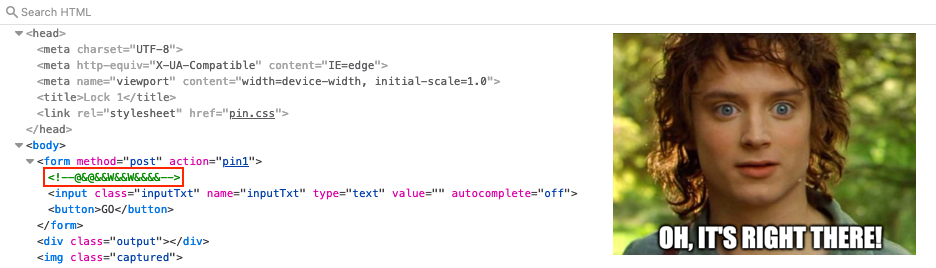

# Open Boria Mine Door

**Difficulty**: :fontawesome-solid-star::fontawesome-solid-star::fontawesome-solid-star::fontawesome-regular-star::fontawesome-regular-star:<br/>
**Direct link**: [Minedoor website](https://hhc22-novel.kringlecon.com?&challenge=minedoor)


## Objective

!!! question "Request"
    Open the door to the Boria Mines. Help Alabaster Snowball in the Web Ring to get some hints for this challenge.

??? quote "Hal Tandybuck"
    Oh hi, I'm Hal Tandybuck. And who might you be?<br/>
    I'm hanging out by the door to the mines here because, well, I haven't figured out the locks yet.<br/>
    It actually reminds me of this locked crate I had three years ago...<br/>
    I doubt we'll get much in the way of debug output.<br/>
    Think you can help me get through?


## Hints

??? hint "Content-Security-Policy"
    Understanding how [Content-Security-Policy](https://cheatsheetseries.owasp.org/cheatsheets/Content_Security_Policy_Cheat_Sheet.html) works can help with this challenge.

??? hint "Input Validation"
    Developers use both client- and server-side [input validation](https://cheatsheetseries.owasp.org/cheatsheets/Input_Validation_Cheat_Sheet.html) to keep out naughty input.

??? hint "Lock Mechanism"
    The locks take input, render some type of image, and process on the back end to unlock. To start, take a good look at the source HTML/JavaScript.


## Solution

### Lock 1

To solve this objective only the first 3 locks need to be opened. The remaining locks aren't required, but opening them will result in an additional hint. To unlock, each colored input needs to be connected with its output by a path in the corresponding color. We do this by submitting text, HTML, or JavaScript. The server renders our input and converts it to an image which is inserted on the lock. For the first lock there aren't any restrictions and a sample solution is even provided in the HTML source itself.

{ class=border }

Entering `@&@&&W&&W&&&&` creates a path between the white input and white output since each character is connected with the one next to it. As an alternative we can also submit a series of [`&block;`](https://theasciicode.com.ar/extended-ascii-code/block-graphic-character-ascii-code-219.html) characters which will be rendered as a horizontal white bar.

{ class=border }


### Lock 2

Looking at the HTML source for the second lock we see that it defines a Content-Security-Policy for [stylesheets](https://developer.mozilla.org/en-US/docs/Web/HTTP/Headers/Content-Security-Policy/style-src). However, it explicitly specifies `unsafe-inline` which means it allows style information between `<style></style>` tags or on HTML objects.

{ class=border }

To connect input and output we can submit an HTML `div` element with inline CSS which renders a white rectangle large enough to fill the whole lock. For example, `<div style="background: white; width: 200px; height: 170px;"></div>` does the trick.

{ class=border }


### Lock 3

Input on this lock is also restricted by a Content-Security-Policy, but this time the `unsafe-inline` directive applies to [JavaScript](https://developer.mozilla.org/en-US/docs/Web/HTTP/Headers/Content-Security-Policy/script-src).

{ class=border }

By submitting `<script>document.body.style.backgroundColor="blue";</script>` we change the background of the `body` tag to blue. This will cause the server to render a blue square that covers the whole lock, creating a path between input and output.

Alternatively, we can use the previous `div` technique but with a blue background on the second lock first to make the server render a blue image, copy the image link, and then submit `` on the third lock.

{ class=border }


### Lock 4

No Content-Security-Policy this time. Instead, the lock applies client-side input validation on the HTML form. Each time the input field loses focus the `sanitizeInput()` JavaScript function is called which strips certain characters like `<`, `>`, `"`, and `'`.

{ class=border }

To get past the input validation we need to remove the [`onblur`](https://www.w3schools.com/jsref/event_onblur.asp) event listener from the `input` form element using our web browser's developer tools. We're now free to submit two `div` elements with a white (line 1) and blue (line 2) background, respectively.

```html linenums="1" title="Create lock 4 image"
<div style="background: white; width: 200px; height: 85px;"></div>
<div style="background: blue; width: 200px; height: 85px;"></div>
```

{ class=border }


### Lock 5

The fifth lock is a combination of the restrictions from the previous two locks. First, there's restrictions applied via a Content-Security-Policy. Luckily for us an `unsafe-inline` directive allows inline [JavaScript](https://developer.mozilla.org/en-US/docs/Web/HTTP/Headers/Content-Security-Policy/script-src). Secondly, there's client-side input validation via the same `sanitizeInput()` JavaScript function as seen on Lock 4.

{ class=border }

We already know we can bypass the client-side input validation by deleting the `onblur` event listener from the `input` form element. The bigger challenge is finding a way to draw an image that will connect the weirdly positioned inputs and outputs. By using a `canvas` element (lines 2-4) in combination with JavaScript code which applies a blue background (lines 6-7), draws an outline (lines 8-13), and fills the outline with red (lines 14-15), we can make the server render the desired image and open the lock.

```javascript linenums="1" title="Create lock 5 image"
<script>
/* Create and set the canvas size */
canvas = document.createElement('canvas');
canvas.width = 200;
canvas.height = 200;
context = canvas.getContext("2d");
/* Fill the background with blue */
context.fillStyle = "blue";
context.fillRect(0, 0, 200, 200);
/* Draw an outline and fill with red */
context.beginPath();
context.moveTo(0, 0);
context.lineTo(200, 0);
context.lineTo(200, 90);
context.lineTo(0, 200);
context.lineTo(0, 0);
context.fillStyle = "red";
context.fill();
/* Set the canvas as the only body element */
document.body.replaceChildren(canvas);
</script>
```

{ class=border }


### Lock 6

As expected, the final lock is the most restrictive with a Content-Security-Policy for both stylesheets and JavaScript. This means none of our previously used techniques will work as there's no `unsafe-inline` directives to exploit.

{ class=border }

We could leverage the previous `canvas` solution by first making lock 1, 3, 4, or 5 render the image we need for lock 6 (see below), copying the image link, and submitting `` on the final lock.

??? info "Create lock 6 image"
    ```javascript linenums="1"
    <script>
    /* Create and set the canvas size */
    canvas = document.createElement('canvas');
    canvas.width = 200;
    canvas.height = 200;
    context = canvas.getContext("2d");
    /* Fill the background with green */
    context.fillStyle = "#00ff00";
    context.fillRect(0, 0, 200, 200);
    /* Draw the first outline and fill with red */
    context.beginPath();
    context.moveTo(0, 90);
    context.lineTo(200, 90);
    context.lineTo(200, 200);
    context.lineTo(0, 120);
    context.lineTo(0, 90);
    context.fillStyle = "red";
    context.fill();
    /* Draw the second outline and fill with blue */
    context.beginPath();
    context.moveTo(0, 120);
    context.lineTo(200, 200);
    context.lineTo(0, 200);
    context.lineTo(0, 120);
    context.fillStyle = "blue";
    context.fill();
    /* Set the canvas as the only body element */
    document.body.replaceChildren(canvas);
    </script>
    ```

Instead, let's opt for a technique we haven't used before. Images can be added to an HTML page by putting [Base64-encoded image data](https://www.w3docs.com/snippets/html/how-to-display-base64-images-in-html.html) in the `src` attribute of an `img` element. Create a PNG image in your preferred image editor, use `base64 image.png` or [CyberChef](https://gchq.github.io/CyberChef/) to generate the Base4-encoded image data, and submit it on the lock using ``. Expand the section below for an example, based on [this PNG image](../artifacts/objectives/o9/red-blue-green.png), which can be copy/pasted onto the final lock.

??? info "Lock 6 Base64-encoded image"
    ```html
    <img src="data:image/png;base64,
    iVBORw0KGgoAAAANSUhEUgAAAMgAAACqCAYAAADoZADPAAAAAXNSR0IArs4c6QAAAKRlWElmTU0AKgAAAAgABgESAAMAA
    AABAAEAAAEaAAUAAAABAAAAVgEbAAUAAAABAAAAXgEoAAMAAAABAAIAAAEyAAIAAAAUAAAAZodpAAQAAAABAAAAegAAAA
    AAAABIAAAAAQAAAEgAAAABMjAyMjoxMjowOCAyMjoyMToxNAAAA6ABAAMAAAABAAEAAKACAAQAAAABAAAAyKADAAQAAAA
    BAAAAqgAAAACiqz2XAAAACXBIWXMAAAsTAAALEwEAmpwYAAAGqWlUWHRYTUw6Y29tLmFkb2JlLnhtcAAAAAAAPHg6eG1w
    bWV0YSB4bWxuczp4PSJhZG9iZTpuczptZXRhLyIgeDp4bXB0az0iWE1QIENvcmUgNi4wLjAiPgogICA8cmRmOlJERiB4b
    WxuczpyZGY9Imh0dHA6Ly93d3cudzMub3JnLzE5OTkvMDIvMjItcmRmLXN5bnRheC1ucyMiPgogICAgICA8cmRmOkRlc2
    NyaXB0aW9uIHJkZjphYm91dD0iIgogICAgICAgICAgICB4bWxuczpleGlmPSJodHRwOi8vbnMuYWRvYmUuY29tL2V4aWY
    vMS4wLyIKICAgICAgICAgICAgeG1sbnM6dGlmZj0iaHR0cDovL25zLmFkb2JlLmNvbS90aWZmLzEuMC8iCiAgICAgICAg
    ICAgIHhtbG5zOnhtcE1NPSJodHRwOi8vbnMuYWRvYmUuY29tL3hhcC8xLjAvbW0vIgogICAgICAgICAgICB4bWxuczpzd
    EV2dD0iaHR0cDovL25zLmFkb2JlLmNvbS94YXAvMS4wL3NUeXBlL1Jlc291cmNlRXZlbnQjIgogICAgICAgICAgICB4bW
    xuczp4bXA9Imh0dHA6Ly9ucy5hZG9iZS5jb20veGFwLzEuMC8iCiAgICAgICAgICAgIHhtbG5zOnBob3Rvc2hvcD0iaHR
    0cDovL25zLmFkb2JlLmNvbS9waG90b3Nob3AvMS4wLyI+CiAgICAgICAgIDxleGlmOkNvbG9yU3BhY2U+NjU1MzU8L2V4
    aWY6Q29sb3JTcGFjZT4KICAgICAgICAgPGV4aWY6UGl4ZWxYRGltZW5zaW9uPjY1NzwvZXhpZjpQaXhlbFhEaW1lbnNpb
    24+CiAgICAgICAgIDxleGlmOlBpeGVsWURpbWVuc2lvbj4zMzU8L2V4aWY6UGl4ZWxZRGltZW5zaW9uPgogICAgICAgIC
    A8dGlmZjpJbWFnZVdpZHRoPjY1NzwvdGlmZjpJbWFnZVdpZHRoPgogICAgICAgICA8dGlmZjpSZXNvbHV0aW9uVW5pdD4
    yPC90aWZmOlJlc29sdXRpb25Vbml0PgogICAgICAgICA8dGlmZjpJbWFnZUxlbmd0aD4zMzU8L3RpZmY6SW1hZ2VMZW5n
    dGg+CiAgICAgICAgIDx0aWZmOk9yaWVudGF0aW9uPjE8L3RpZmY6T3JpZW50YXRpb24+CiAgICAgICAgIDx0aWZmOlhSZ
    XNvbHV0aW9uPjcyPC90aWZmOlhSZXNvbHV0aW9uPgogICAgICAgICA8dGlmZjpZUmVzb2x1dGlvbj43MjwvdGlmZjpZUm
    Vzb2x1dGlvbj4KICAgICAgICAgPHhtcE1NOkhpc3Rvcnk+CiAgICAgICAgICAgIDxyZGY6U2VxPgogICAgICAgICAgICA
    gICA8cmRmOmxpIHJkZjpwYXJzZVR5cGU9IlJlc291cmNlIj4KICAgICAgICAgICAgICAgICAgPHN0RXZ0OnNvZnR3YXJl
    QWdlbnQ+QWZmaW5pdHkgRGVzaWduZXIgMiAyLjAuMDwvc3RFdnQ6c29mdHdhcmVBZ2VudD4KICAgICAgICAgICAgICAgI
    CAgPHN0RXZ0OmFjdGlvbj5wcm9kdWNlZDwvc3RFdnQ6YWN0aW9uPgogICAgICAgICAgICAgICAgICA8c3RFdnQ6d2hlbj
    4yMDIyLTEyLTA4VDIyOjIxOjE0KzAxOjAwPC9zdEV2dDp3aGVuPgogICAgICAgICAgICAgICA8L3JkZjpsaT4KICAgICA
    gICAgICAgPC9yZGY6U2VxPgogICAgICAgICA8L3htcE1NOkhpc3Rvcnk+CiAgICAgICAgIDx4bXA6TW9kaWZ5RGF0ZT4y
    MDIyLTEyLTA4VDIyOjIxOjE0KzAxOjAwPC94bXA6TW9kaWZ5RGF0ZT4KICAgICAgICAgPHhtcDpNZXRhZGF0YURhdGU+M
    jAyMi0xMi0wOFQyMjoyMToxNCswMTowMDwveG1wOk1ldGFkYXRhRGF0ZT4KICAgICAgICAgPHBob3Rvc2hvcDpJQ0NQcm
    9maWxlPkRpc3BsYXk8L3Bob3Rvc2hvcDpJQ0NQcm9maWxlPgogICAgICAgICA8cGhvdG9zaG9wOkNvbG9yTW9kZT4zPC9
    waG90b3Nob3A6Q29sb3JNb2RlPgogICAgICA8L3JkZjpEZXNjcmlwdGlvbj4KICAgPC9yZGY6UkRGPgo8L3g6eG1wbWV0
    YT4KB1H9dwAACQhJREFUeAHtnXmoFVUcx7/Pl5VtGpZtGJa2U2gZtEOlBtpGCxEVWFD9U9G+YREl7UVU/1RQgUZIC2kpZ
    FagWUFWUrRYWpK0WZZlq6av+Y1cfe963++8671z78ycz9Tj3Te/OzPnfH7n45mZe+6cDnUl/7FAAAI1CfSruZaVEIBASg
    BBaAgQcAggiAOHEAQQhDYAAYcAgjhwCEEAQWgDEHAIIIgDhxAEEIQ2AAGHAII4cAhBAEFoAxBwCCCIA4cQBBCENgABhwC
    COHAIQQBBaAMQcAggiAOHEAQQhDYAAYcAgjhwCEEAQWgDEHAIIIgDhxAEEIQ2AAGHAII4cAhBAEFoAxBwCCCIA4cQBBCE
    NgABhwCCOHAIQQBBaAMQcAggiAOHEAQQhDYAAYcAgjhwCEEAQWgDEHAIIIgDhxAEEIQ2AAGHAII4cAhBAEFoAxBwCCCIA
    4cQBBCENgABhwCCOHAIQQBBaAMQcAggiAOHEAQQhDYAAYcAgjhwCEEAQWgDEHAIIIgDhxAEEIQ2AAGHAII4cAhBAEFoAx
    BwCCCIA4cQBBCENgABhwCCOHAIQQBBaAMQcAggiAOHEAQQhDYAAYcAgjhwCEEAQWgDEHAIIIgDhxAEEIQ2AAGHAII4cAh
    BoGPmeHWtSzSp/Kzt3Pja1rX673YcM1THvpSJplROAh1dUvI/S6MEKv/AVH6HpGs03hdpGz1GvduXoUzV7QBBqonwd9QE
    ujp6njUhSNTNgcqHCHCRHiJEPGoCCBJ1+ql8iACChAgRj5oAgkSdfiofIoAgIULEoyaAIFGnn8qHCCBIiBDxqAkgSNTpp
    /IhAggSIkQ8agIIEnX6qXyIAIKECBGPmgCCRJ1+Kh8igCAhQsSjJoAgUaefyocIIEiIEPGoCSBI1Omn8iECCBIiRDxqAg
    gSdfqpfIgAgoQIEY+aAIJEnX4qHyKAICFCxKMmgCBRp5/KhwggSIgQ8agJIEjU6afyIQIIEiJEPGoCCBJ1+ql8iACChAg
    Rj5oAgkSdfiofIoAgIULEoyaAIFGnn8qHCCBIiBDxqAkgSNTpp/IhAggSIkQ8agIIEnX6qXyIAIKECBGPmgCCRJ1+Kh8i
    gCAhQsSjJoAgUaefyocIIEiIEPGoCSBI1Omn8iECCBIiRDxqAp0DddVtv2hwAqFDO+h3dWpd1ECoPAS6E+iQuroqK7bQf
    xqmpdpHX2pffdHj9576Rv2Qp4KK35EQ6CGIV+et9K+Ga0kPaSoS7a7vvE2JQaCwBPosiFfDbfVnKk73nqfyeif97G1KDA
    K5JtAUQbwaDtLK9HTtUH2g0Vqgw/WeDtInybXOWm8zYhDIBYHMBalVy230l0bpw1SWijTW43Row+VQrc1YB4GWE2iLILV
    qaT3NYXp/Qy9jPY3dGGCBQDsJ5EaQWhCGaHmPXsaksXUsEGgVgVwLUguC9SomSuXUzH4P1G+13so6CDRMoHCCVNfYrlvs
    +qUijMlj1zd2ncMCgUYJFF6QWgDsDtmB+lRH6W2doDfSH2431yLFuhCBUgpSXWnrZQ7RR6koJ+p1Hae52l6rqt/G3xDYh
    EAUglTX2obU2KmYyWI9jPU0NlKABQLVBKIUpBrCAP2tozU/lWWM5qTXM3wmU00pzr8RpEbed9GPmqCZOkUva6xekw2lYY
    mTAIIE8r61/kl7FpPFfvbQt4EtCJeJAILUmU27hXyqZqSy2PgyTsXqBFiwtyNIAwmzYf4n6xWdoRfTC367+GcpFwEEaVI
    +d9ZPOlvP6Vw9m17w07M0CWybd4MgGSTAhsOco2mpLHZKxlJcAgiSce721+epKNaz2JAYlmIRQJAW5suG85soF2gKo5Jb
    yL2RQyFII/Q2c9v+WqPT9ZIu1WPpLWSuVzYTZAs2Q5AWQPYOMUKLdbGe0IV6Snahz5IvAgiSk3xsqdUbepXj9Safr+QkL
    wiSk0R0L4ZdzFuvMlFP06t0B9OG1wjSBuh9PaSNMLYL+mt1v/bTor5uxvuaSABBmggzq13ZRfxpmq7rda+O1DtZHYb91i
    CAIDWg5HnVMXpL1+m+dCwYd7+yzxSCZM84kyPYB5AmyvmaKrvAZ8mGAIJkw7Vle91N3+tKPaTL9CgPqsiAOoJkALUdu9x
    VP+gW3ZHe/bIPIlmaQwBBmsMxN3vZW1/pdt2aDmlhuorG04IgjTPM5R4O1se6Uzen31fJZQELUigEKUiiNreY9jCKu3ST
    jtW8zd1F1NshSCTpH69ZelBX84FjnflmEs86gRX17bM0Pn143iRNTh5yNKCo1Wh5uelBWo68/Qe0eSgf1hXph43tL02+S
    0APku/8ZFK6pRqWPpnFhq/Ya5beCSBI72xKH5mRaGIP+ba7XauTz+NZNiXAKdamTKJcY6OFH9cl6YO9owTQS6XpQXoBE9
    vqRcn9Lfui1o26m96kW/LpQbrB4OV6AiO1UM/ovPT0K3Ym9CCxt4Aa9V+okemEqo/o8uSbKMm/oREv9CARJ78vVR+n2ck
    XfyfKRg3HuNCDxJj1Ouo8W+Nk47pe0Jl1bFWetyJIeXKZWU1WaLDO0vO6Rg8ksz92ZnacPO6YU6w8ZiXHZbIJhaYlTx7e
    Ub/muJTNKxqCNI9lNHsariXJDCnrP2Qse6U5xSp7hjOo3xIN1xF6N5Ukg93napcIkqt0FKcwq5KJtO35wpM1qdS3gjnFK
    k6bzG1JbeKgKckj7so4lTaC5LbZFatgNuf89OTxdmWbERhBitUOc11ae+qjfTFrkFbmupz1FA5B6qHFe4MEbMq5V3VSaR
    66jSDBlPOGegkcoM+ST0vGlmJOeQSpN/u8v08E9tLXmqMxsud0FXlBkCJnL+dlt3nk5yUPHCqyJAiS80ZW9OLZFHPzk5n
    jh2h5IavCB4WFTFtxCr1YIzRBM/WHtitOobuVFEG6weBlNgQWaHQ6GniN+mdzgAz3iiAZwmXXGwnYrd+L9GThhqUgyMYc
    8ipjAlOT6X5u0D0ZH6W5u+civbk82VsfCNh33W3CnyIsCFKELJWsjDbBz9zkCVw2ZD7vC4LkPUMlLd9QLUsGpYxKvsy7I
    tc15Bok1+kpb+GWaWg6B3zeHyv0P9NiU8xbUR/cAAAAAElFTkSuQmCC">
    ```

{ class=border }

Fun fact, while a little tedious, this final solution can actually be applied to all the locks! :smile:

!!! done "Answer"
    Follow the instructions outlined above to open each lock.


## Response

!!! quote "Hal Tandybuck"
    Great! Thanks so much for your help!<br/>
    When you get to the fountain inside, there are some things you should consider.<br/>
    First, it might be helpful to focus on Glamtariel's CAPITALIZED words.<br/>
    If you finish those locks, I might just have another hint for you!<br/>
    ...<br/>
    Wha - what?? You opened all the locks?! Well then...<br/>
    Did you see the nearby terminal with evidence of an XXE attack?<br/>
    Maybe take a close look at that kind of thing.
